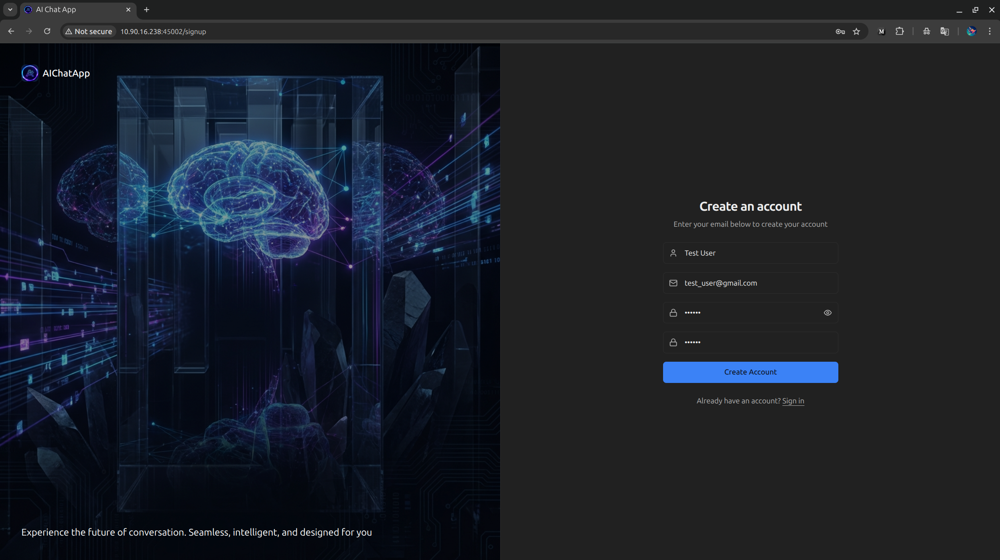
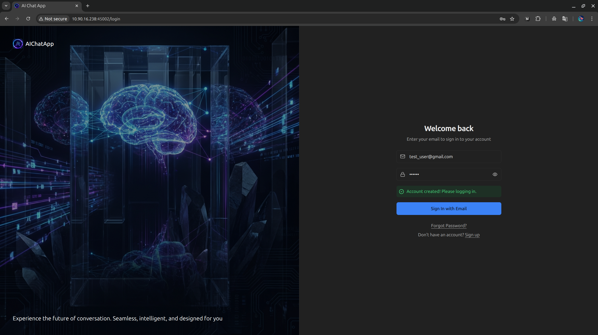
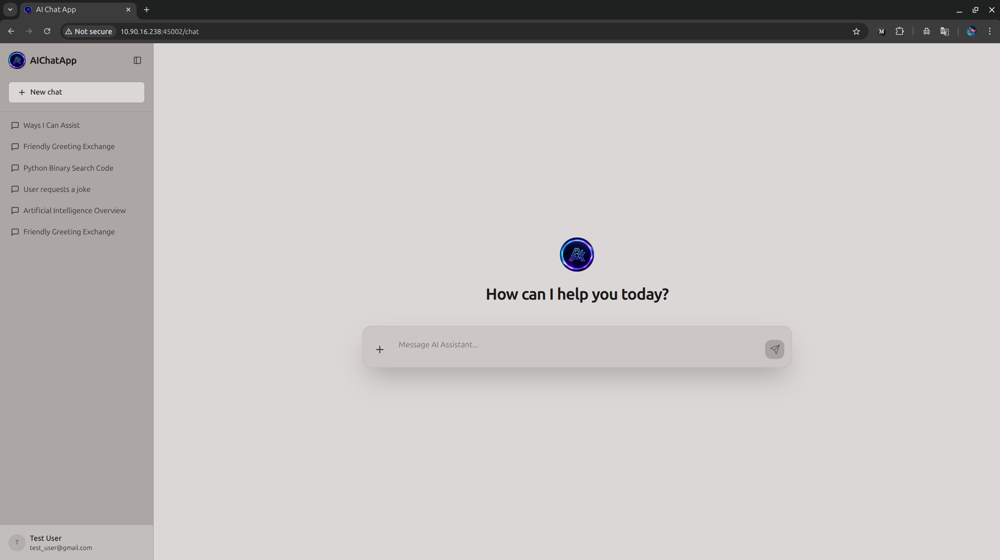
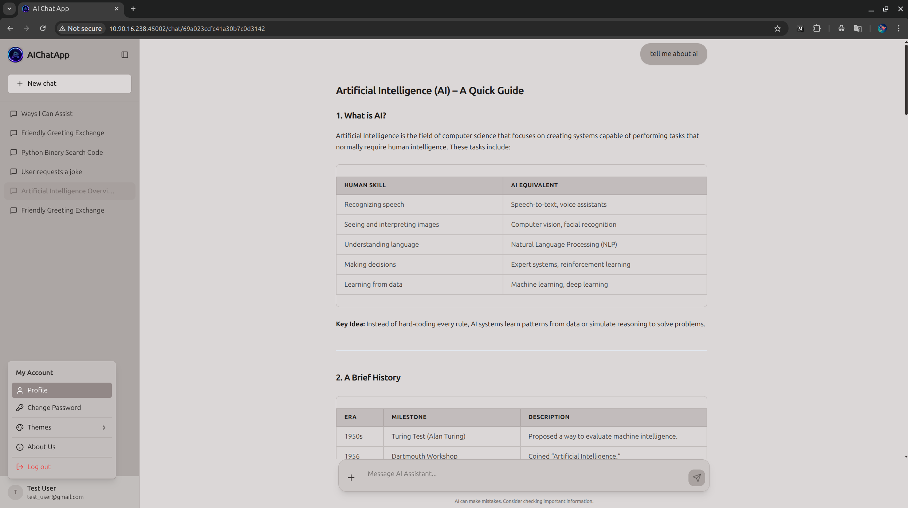

# AI Chat Application UI

      
<br/>

## Overview
A modern, responsive, and feature-rich AI Chat interface built with React, Vite, and Tailwind CSS. This application provides a seamless chat experience with support for authentication, conversation history, and advanced AI services like web search and "thinking" modes.

<table border="0">
  <tr>
    <td></td>
    <td></td>
  </tr>
  <tr>
    <td></td>
    <td></td>
  </tr>
</table>

## ✨ Features

- **🔐 Secure Authentication**: Full signup, login, and password management (change/reset) flows.
- **💬 Real-time Chat**: Smooth, streaming chat interface with markdown support.
- **🔍 Advanced AI Services**: Toggle between standard chat, web search, and thinking models.
- **📜 Conversation History**: Sidebar with persistent chat history, including renaming and deleting conversations.
- **🎨 Premium UI/UX**:
  - Dark/Light mode support.
  - Smooth animations with Framer Motion.
  - Responsive design for all devices.
  - Interactive modals for Profile, About Us, and Settings.
- **🛠️ Robust Architecture**: Integrated with a [FastAPI backend](https://github.com/akgaur12/AIChatApp) for real-time streaming and data persistence.

## 🚀 Tech Stack

- **Frontend**: React 18, Vite
- **Styling**: Tailwind CSS
- **Animations**: Framer Motion
- **Routing**: React Router DOM (v7)
- **Icons**: Lucide React
- **Markdown**: React Markdown, Remark GFM, Rehype Raw
- **API Client**: Axios

## 🛠️ Getting Started

### Prerequisites

- Node.js (v18 or higher)
- npm or yarn

### Installation

1. Clone the repository:
   ```bash
   git clone <repository-url>
   cd AIChatApp-UI
   ```

2. Install dependencies:
   ```bash
   npm install
   ```

3. Configure Environment:
   The application connects to the backend API. Update `src/config.js` if your backend is running on a different host/port.
   ```javascript
   // src/config.js
   API_BASE_URL: "http://localhost:45001"
   ```

### Development

Start the development server:
```bash
npm run dev
```

The application will be available at `http://localhost:5173`.

### Production Build

Create an optimized production build:
```bash
npm run build
```

Preview the production build locally:
```bash
npm run preview
```

## 📂 Project Structure

```text
├── index.html
├── LICENSE
├── package.json
├── package-lock.json
├── postcss.config.js
├── public
│   ├── apple-touch-icon.png
│   ├── auth_banner.png
│   ├── favicon.png
│   └── logo.png
├── README.md
├── src
│   ├── api
│   │   └── client.js
│   ├── App.jsx
│   ├── components
│   │   ├── AboutModal.jsx
│   │   ├── ChangePasswordModal.jsx
│   │   ├── ChatArea.jsx
│   │   ├── ChatInput.jsx
│   │   ├── ChatMessage.jsx
│   │   ├── ProfileModal.jsx
│   │   ├── ProtectedRoute.jsx
│   │   └── Sidebar.jsx
│   ├── config.js
│   ├── context
│   │   ├── AuthContext.jsx
│   │   └── ThemeContext.jsx
│   ├── index.css
│   ├── layouts
│   ├── lib
│   │   ├── jwt.js
│   │   └── utils.js
│   ├── main.jsx
│   └── pages
│       ├── AuthPage.jsx
│       └── ChatPage.jsx
├── tailwind.config.js
└── vite.config.js

```

## 📄 License

This project is licensed under the MIT License - see the [LICENSE](LICENSE) file for details.