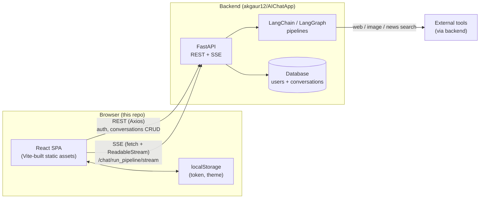
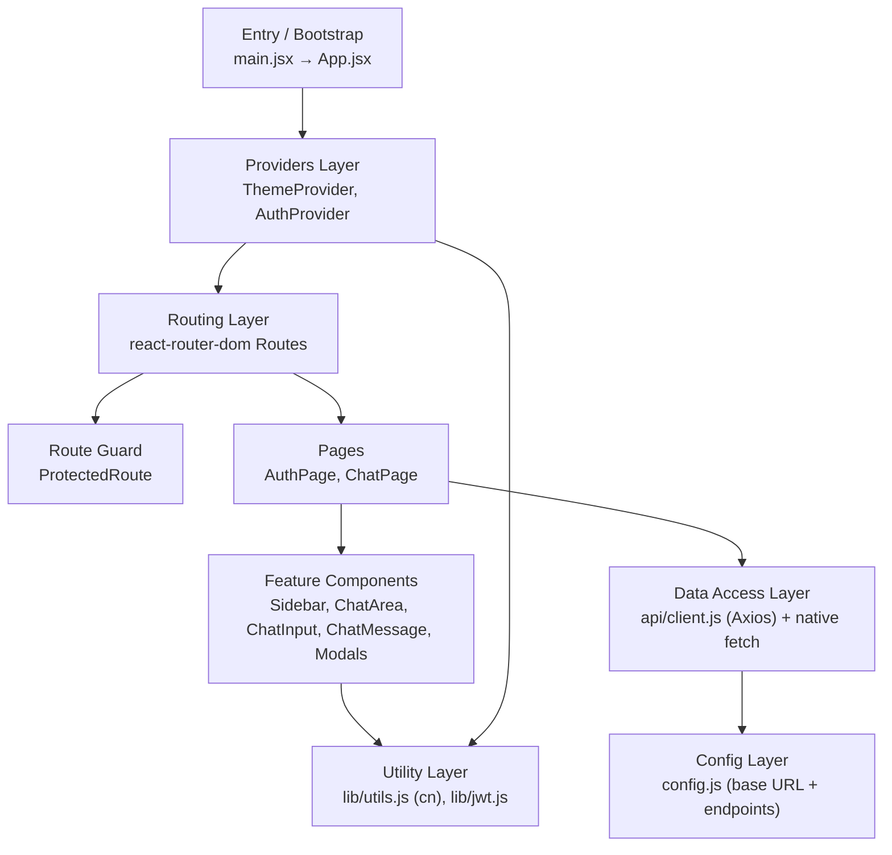
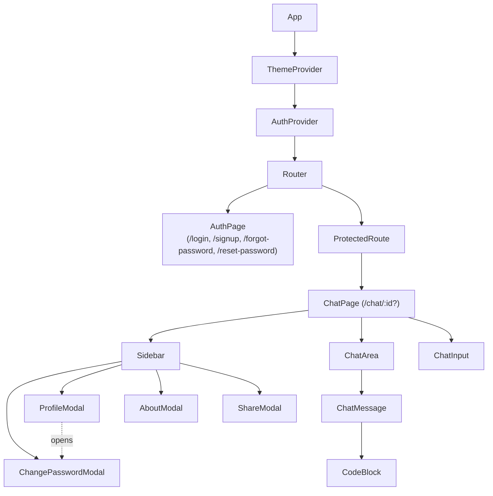

# 02 — High-Level Architecture

[← Back to Index](./index.md)

## The big picture

AIChatApp is a classic **two-tier** system: a stateless React SPA (this repo) and a stateful backend
API (separate repo). The SPA holds only **session state** (the JWT and decoded user, the current
theme, and the in-memory message list); everything durable lives server-side.

Two distinct transport channels are used deliberately (see
[Chapter 15 — Design Patterns](./15-design-patterns.md)):

- **Axios** for ordinary request/response JSON calls (auth, listing/loading/renaming/deleting chats).
- **Native `fetch` + `ReadableStream`** for the streaming chat endpoint, because Axios in the browser
  does not expose a readable byte stream for incremental Server-Sent Events.

## Layered view of the front-end

The front-end is organized into clear layers, each with a single responsibility:

| Layer | Responsibility | Files |
|-------|----------------|-------|
| **Bootstrap** | Mount React, apply StrictMode, import global CSS | `src/main.jsx`, `src/index.css` |
| **Providers** | Global cross-cutting state (auth + theme) | `src/context/AuthContext.jsx`, `src/context/ThemeContext.jsx` |
| **Routing** | URL → view mapping, redirects | `src/App.jsx` |
| **Guards** | Block unauthenticated access | `src/components/ProtectedRoute.jsx` |
| **Pages** | Compose components into screens, own page-level state | `src/pages/AuthPage.jsx`, `src/pages/ChatPage.jsx` |
| **Components** | Reusable, presentational + interactive UI | `src/components/*` |
| **Data access** | HTTP, interceptors, token attachment, SSE parsing | `src/api/client.js`, fetch in `ChatPage` |
| **Config** | Centralized base URL, endpoint map, service list | `src/config.js` |
| **Utilities** | Class merging, JWT decode/expiry | `src/lib/utils.js`, `src/lib/jwt.js` |

## Component tree

`ChatPage` is the **state owner** of the chat experience: it holds `conversations`, `messages`,
loading/streaming flags, and the active service toggles, and passes data and callbacks down to its
children. This is a deliberate "smart page / presentational children" split — see
[Chapter 09 — State Management](./09-state-management.md) and
[Chapter 11 — Core Components](./11-components.md).

## Runtime model

- **Single-page, client-rendered.** `index.html` mounts a single `
` and loads
  `src/main.jsx` as an ES module. There is no SSR.
- **Provider-wrapped router.** Theme and Auth contexts wrap the entire router so every route can read
  them.
- **URL as source of truth for the open chat.** The route `/chat/:id?` drives which conversation is
  loaded; navigating changes the open chat (`src/pages/ChatPage.jsx:83-85`).

## Key architectural characteristics

- **No global store library.** State is intentionally kept local to `ChatPage` or in two small
  contexts. This keeps the dependency surface small at the cost of some prop-drilling.
- **Optimistic UI.** User messages and an empty assistant placeholder are inserted immediately on send,
  then the placeholder is filled as the stream arrives (`src/pages/ChatPage.jsx:130-138`).
- **Centralized configuration.** All endpoints and the API base URL live in one file (`src/config.js`)
  so the backend target can be changed in one place.
- **Theme via CSS variables + class on `<html>`.** Switching themes toggles a class on the document
  root; all colors are HSL CSS variables resolved by Tailwind (see
  [Chapter 13 — Theming & Styling](./13-theming-styling.md)).

## Related chapters

- [Chapter 10 — API Integration & Contracts](./10-api-integration.md) for the wire-level detail.
- [Chapter 14 — Data Flow & Sequence Diagrams](./14-data-flow.md) for end-to-end flows.
- [Chapter 15 — Design Patterns & Decisions](./15-design-patterns.md) for the "why".
