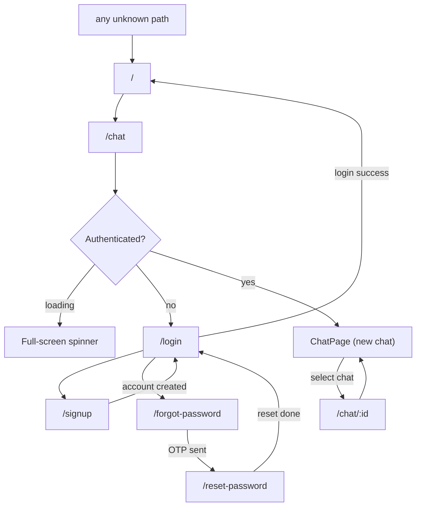

# 07 — Routing & Navigation

[← Back to Index](./index.md)

Routing uses **react-router-dom v7** with `BrowserRouter`. All routes are declared in `src/App.jsx`.

## Route table

```jsx
<Routes>
  {/* Public */}
  <Route path="/login"           element={<AuthPage />} />
  <Route path="/signup"          element={<AuthPage />} />
  <Route path="/forgot-password" element={<AuthPage />} />
  <Route path="/reset-password"  element={<AuthPage />} />

  {/* Private */}
  <Route path="/chat/:id?" element={
    <ProtectedRoute><ChatPage /></ProtectedRoute>
  } />
  <Route path="/" element={<Navigate to="/chat" replace />} />

  {/* Catch-all */}
  <Route path="*" element={<Navigate to="/" replace />} />
</Routes>
```

| Path | Access | Component | Notes |
|------|--------|-----------|-------|
| `/login` | Public | `AuthPage` | Login form |
| `/signup` | Public | `AuthPage` | Registration form |
| `/forgot-password` | Public | `AuthPage` | Request OTP |
| `/reset-password` | Public | `AuthPage` | Enter OTP + new password |
| `/chat/:id?` | **Protected** | `ChatPage` | `:id` optional — `/chat` is a new chat, `/chat/<id>` opens an existing one |
| `/` | redirect | — | → `/chat` (then guarded) |
| `*` | redirect | — | → `/` (then → `/chat`) |

## Two key routing ideas

### 1. One page, four auth routes

`AuthPage` renders **all four** auth screens. It reads the current path via `useLocation()` and sets
booleans (`isLogin`, `isSignup`, `isForgotPassword`, `isResetPassword`) to decide which fields,
headings, and submit behavior to show (`src/pages/AuthPage.jsx:16-19`). This keeps the shared layout
(branding hero + form column) in one place. See [Chapter 11](./11-components.md#authpage).

### 2. The open conversation *is* the URL

`ChatPage` reads `:id` with `useParams()`. An effect reloads messages whenever `id` changes
(`src/pages/ChatPage.jsx:83-85`):

```jsx
useEffect(() => { loadChat(id); }, [id, loadChat]);
```

Consequences:
- Opening a chat = `navigate('/chat/<id>')`.
- Starting a new chat = `navigate('/chat')` (no id → empty message list).
- When the backend creates a conversation during the first stream, the UI replaces the URL with the
  new id using `navigate(..., { replace: true })` so the browser history isn't polluted
  (`src/pages/ChatPage.jsx:216`).

## Route guard

`ProtectedRoute` wraps `ChatPage`:

```jsx
export default function ProtectedRoute({ children }) {
    const { user, loading } = useAuth();
    if (loading) return <Spinner />;           // auth still initializing
    if (!user)  return <Navigate to="/login" replace />;
    return children;
}
```

- While `AuthProvider` is still checking `localStorage` for a token (`loading === true`), a full-screen
  spinner is shown to avoid a flash of the login page.
- If there is no authenticated `user`, the user is redirected to `/login`.
- See [Chapter 08 — Authentication](./08-authentication.md) for how `user`/`loading` are derived.

## Navigation flow



## Navigation primitives used

- **`useNavigate()`** — imperative navigation (after login, on chat select/new/delete, after stream
  creates a new conversation).
- **`<Link>`** — declarative links between auth screens (`AuthPage` footer).
- **`<Navigate replace>`** — redirects for `/`, catch-all, and the guard.
- **`useParams()` / `useLocation()`** — read the active chat id and the active auth route.

> **Minor note:** one footer link in `AuthPage` uses the lowercase HTML attribute `class` instead of
> `className` (`src/pages/AuthPage.jsx:313`). React will warn in the console; the link still works but
> the className isn't applied as intended. Worth fixing.

## Related chapters

- [Chapter 08 — Authentication & Authorization](./08-authentication.md)
- [Chapter 14 — Data Flow & Sequence Diagrams](./14-data-flow.md)
