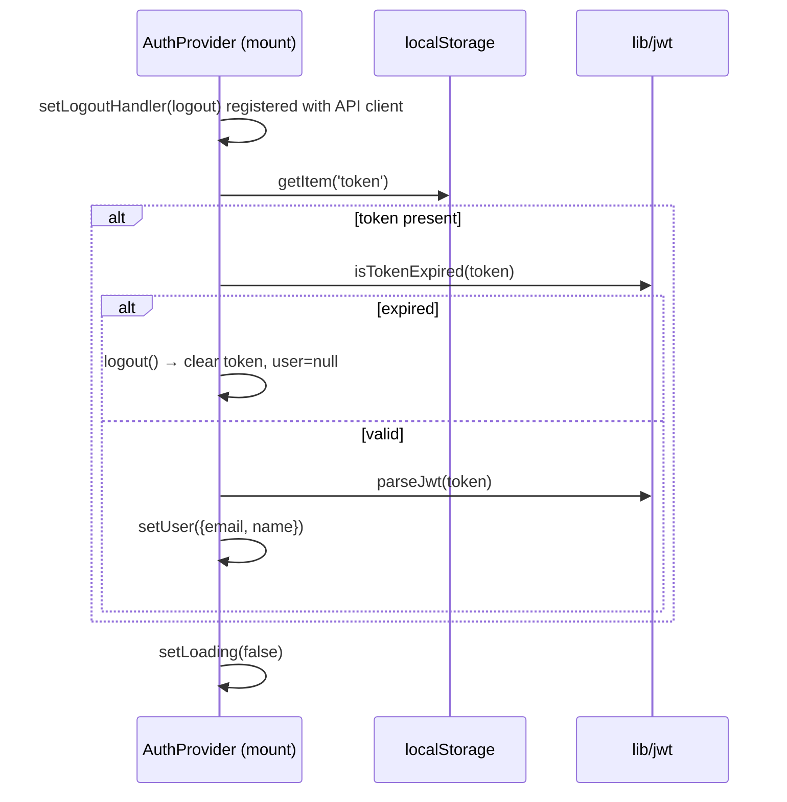
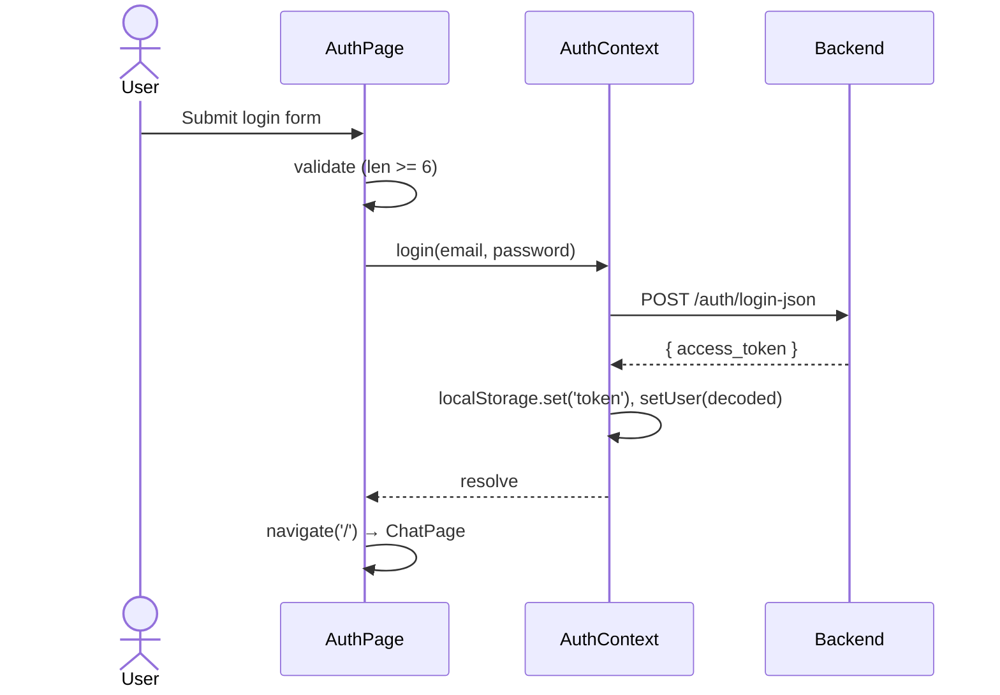
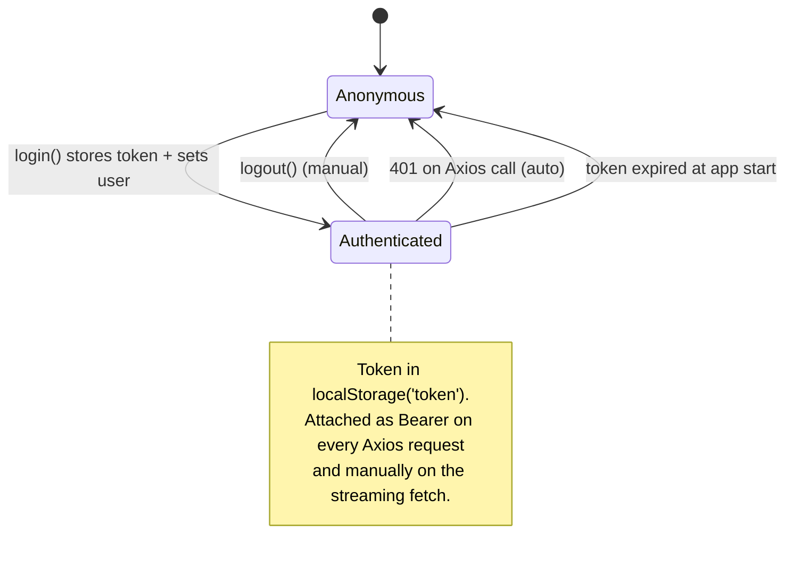

# 08 — Authentication & Authorization

[← Back to Index](./index.md)

Authentication is **JWT-based**. The backend issues a token; the UI stores it in `localStorage`,
attaches it to every request, decodes it client-side to derive the current user, and clears it on
logout or `401`.

## Components involved

| Concern | File |
|---------|------|
| Auth state + actions | `src/context/AuthContext.jsx` |
| Token decode + expiry | `src/lib/jwt.js` |
| Token attachment + 401 handling | `src/api/client.js` |
| Auth UI (login/signup/forgot/reset) | `src/pages/AuthPage.jsx` |
| Change password | `src/components/ChangePasswordModal.jsx` |
| Delete account | `src/components/ProfileModal.jsx` |
| Route protection | `src/components/ProtectedRoute.jsx` |

## The `AuthContext`

`AuthProvider` (`src/context/AuthContext.jsx`) exposes via `useAuth()`:

| Member | Type | Description |
|--------|------|-------------|
| `user` | `{ email, name } \| null` | Derived from JWT claims, or `null` when logged out |
| `loading` | `boolean` | `true` until the initial token check completes |
| `login(email, password)` | async | Posts credentials, stores token, sets user |
| `logout()` | sync | Clears token + user |
| `signup(name, email, password, role="ROLE_USER")` | async | Registers a new account |
| `deleteAccount()` | async | Deletes the current user on the backend |

### Deriving the user from the token

There is **no `/me` call**. The user object is built entirely from JWT claims
(`src/context/AuthContext.jsx:12-29`):

```javascript
const decoded = parseJwt(token);
setUser({
    email: decoded.sub || decoded.email,
    name:  decoded.name || decoded.preferred_username || decoded.nickname || 'User',
});
```

So the displayed name/email depend on which claims the backend includes. If decoding fails entirely a
fallback `{ email: "user@example.com", name: "User" }` is used.

### Initialization (on app load)



Until `loading` flips to `false`, `ProtectedRoute` shows a spinner so there's no flash of `/login`.

## JWT utilities — `src/lib/jwt.js`

```javascript
parseJwt(token)        // base64url-decode the payload segment → object (or null on failure)
isTokenExpired(token)  // true if no token, no exp claim, or exp < now (seconds)
```

- `parseJwt` decodes **only the payload** (the middle segment). It does **not** verify the signature —
  verification is the backend's responsibility. This is purely for reading display claims and `exp`.
- `isTokenExpired` compares `decoded.exp` against `Math.floor(Date.now()/1000)`.

## Token attachment & 401 handling — `src/api/client.js`

The Axios instance attaches the bearer token on every request via a **request interceptor**:

```javascript
client.interceptors.request.use((config) => {
    const token = localStorage.getItem('token');
    if (token) config.headers.Authorization = `Bearer ${token}`;
    return config;
});
```

And handles expiry/invalidity via a **response interceptor**:

```javascript
client.interceptors.response.use(
  (response) => response,
  (error) => {
    if (error.response?.status === 401) {
        localStorage.removeItem('token');
        if (onLogout) onLogout();   // calls the registered AuthContext.logout
    }
    return Promise.reject(error);
  }
);
```

The decoupling via `setLogoutHandler` lets the non-React `client.js` module trigger React state
changes (logout) without importing the context directly — see
[Chapter 15 — Design Patterns](./15-design-patterns.md).

> **Important:** the **streaming** request in `ChatPage` uses raw `fetch`, **not** the Axios client,
> so it bypasses these interceptors. It attaches the token manually
> (`src/pages/ChatPage.jsx:160`) but does **not** trigger the global logout on a 401 — it only throws.
> See [Chapter 16 — Error Handling](./16-error-handling.md).

## The four auth flows (`AuthPage`)

All driven by the route (see [Chapter 07](./07-routing.md)). `handleSubmit`
(`src/pages/AuthPage.jsx:40-98`) branches on the active mode:

### Login (`/login`)
- Client validation: password ≥ 6 chars.
- `login(email, password)` → `POST /auth/login-json {email, password}` → `{ access_token }`.
- Token stored, user set, navigate to `/`.

### Signup (`/signup`)
- Validation: password ≥ 6 chars and matches confirmation.
- `signup(name, email, password)` → `POST /auth/signup { name, email, password, role: ["ROLE_USER"] }`.
- On success: success message, then redirect to `/login` after 2s. (Signup does **not** auto-login.)

### Forgot password (`/forgot-password`)
- `POST /auth/forget-password { email }`.
- On success: "OTP sent", redirect to `/reset-password` after 1.5s.

### Reset password (`/reset-password`)
- Validation: new password ≥ 6 chars and matches confirmation.
- `POST /auth/verify-otp-reset-password { email, otp, new_password }`.
- On success: redirect to `/login` after 2s.



## Change password

`ChangePasswordModal` (opened from the profile menu) posts to `changePassword`:

```javascript
client.put(config.endpoints.auth.changePassword, {  // PUT /auth/reset-password
    old_password: oldPassword,
    new_password: newPassword,
});
```

Validations: new password ≥ 6 chars and equals confirmation. On success it shows a message and closes
after 2s.

## Delete account

In `ProfileModal`, `deleteAccount()` calls `DELETE /auth/delete-user` after a **two-step
confirmation** (see [Chapter 12 — Features](./12-features.md#account--data-management)). On success it
logs out and closes.

## Authorization model

- **Role at signup:** the UI always sends `role: ["ROLE_USER"]` (`src/context/AuthContext.jsx:73`).
  There is no UI for elevated roles.
- **Client-side gate:** the only front-end authorization is "is there a valid, non-expired token?",
  enforced by `ProtectedRoute`. **All real authorization is enforced by the backend** on each request.

## Token lifecycle summary



## Security note (see Chapter 17)

Storing JWTs in `localStorage` makes them readable by any JavaScript on the page (XSS exposure) and
they are not auto-expired by the browser. This is a deliberate simplicity trade-off; see
[Chapter 17 — Security](./17-security.md) for the full discussion and alternatives.

## Related chapters

- [Chapter 09 — State Management](./09-state-management.md)
- [Chapter 10 — API Integration](./10-api-integration.md)
- [Chapter 17 — Security](./17-security.md)
