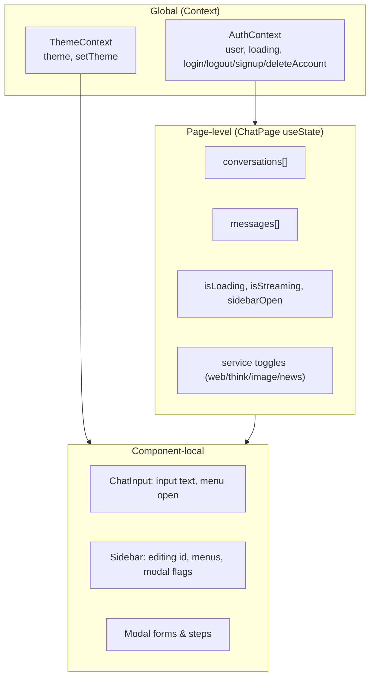
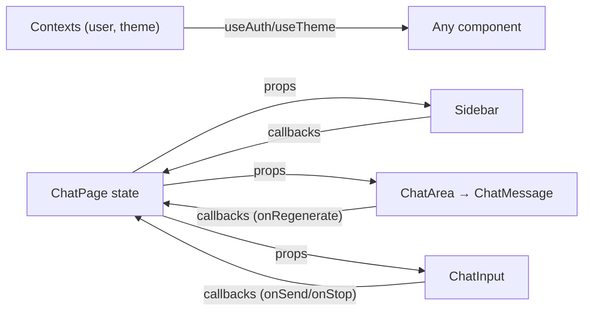

# 09 — State Management

[← Back to Index](./index.md)

The app uses **React's built-in Context API and local component state** — there is no Redux, Zustand,
MobX, or React Query. State is split into three tiers.

## The three tiers of state



### Tier 1 — Global context

Two providers wrap the whole app in `App.jsx` (order matters only in that both must be above the
router):

```jsx
<ThemeProvider defaultTheme="dark" storageKey="vite-ui-theme">
  <AuthProvider>
    <Router> ... </Router>
  </AuthProvider>
</ThemeProvider>
```

#### `AuthContext` (`src/context/AuthContext.jsx`)
Covered in depth in [Chapter 08](./08-authentication.md). Exposes `user`, `loading`, and the auth
actions. Any component calls `useAuth()` to read the user or trigger login/logout.

#### `ThemeContext` (`src/context/ThemeContext.jsx`)
Exposes `{ theme, setTheme }`.

```javascript
const [theme, setTheme] = useState(
  () => localStorage.getItem(storageKey) || defaultTheme   // lazy init from storage
);

useEffect(() => {
  const root = window.document.documentElement;
  root.classList.remove(/* ...every known theme class... */);
  if (theme === "system") {
    root.classList.add(prefersDark ? "dark" : "light");
    return;
  }
  root.classList.add(theme);
}, [theme]);

// setTheme persists then updates state:
setTheme: (t) => { localStorage.setItem(storageKey, t); setThemeState(t); }
```

Key points:
- Theme persists under the `localStorage` key **`vite-ui-theme`** (passed from `App.jsx`).
- The default theme is **`dark`** (also from `App.jsx`).
- Switching themes mutates the **class list on `<html>`** — all styling reacts via CSS variables (see
  [Chapter 13](./13-theming-styling.md)).
- `"system"` is supported (follows OS preference) but the UI's theme menu only offers explicit themes.

### Tier 2 — Page-level state (`ChatPage`)

`ChatPage` is the **smart container** for the chat experience. It owns
(`src/pages/ChatPage.jsx:16-25`):

| State | Purpose |
|-------|---------|
| `conversations` | The sidebar list, fetched from `/chat/conversations` |
| `messages` | The currently displayed thread (flattened user/assistant pairs) |
| `isLoading` | A request is in flight (shows spinner / disables input) |
| `isStreaming` | A response stream is active (enables Stop, shows cursor) |
| `sidebarOpen` | Sidebar visibility (responsive) |
| `selectedService` | Default service id |
| `isWebSearch` / `isThinking` / `isImageSearch` / `isNewsSearch` | Mutually-exclusive service toggles |
| `abortControllerRef` | A ref (not state) holding the `AbortController` for the active stream |

It passes data + callbacks down to `Sidebar`, `ChatArea`, and `ChatInput`. This is classic
**lifting state up**: children are mostly presentational and communicate via callbacks
(`onSelectChat`, `onSend`, `onStop`, `onRegenerate`, `onRenameChat`, …).

> **Why a ref for the AbortController?** It must persist across renders and be mutated imperatively
> without triggering re-renders. `useRef` is the correct tool. See
> [Chapter 12 — Streaming](./12-features.md#real-time-streaming-chat).

### Tier 3 — Component-local state

Each leaf component keeps its own ephemeral UI state:

- **`ChatInput`**: the textarea `input` value and whether the service menu is open.
- **`Sidebar`**: which chat is being renamed (`editingId`), various menu-open flags, modal visibility,
  and computed menu positions (for portal-rendered popovers).
- **Modals** (`ProfileModal`, `ChangePasswordModal`, `ShareModal`): form fields, multi-step
  confirmation counters, and loading/success/error flags.

## Data flow direction



State flows **down** as props; events flow **up** as callbacks; cross-cutting concerns (auth, theme)
are read **sideways** from context.

## Persistence

| What | Where | Key |
|------|-------|-----|
| Auth token | `localStorage` | `token` |
| Selected theme | `localStorage` | `vite-ui-theme` |
| Conversations & messages | **Backend only** | not cached client-side beyond the current view |

There is no client-side cache of messages between sessions — reopening a chat refetches it from the
backend (`loadChat`).

## Trade-offs of this approach

**Pros:** minimal dependencies, easy to follow, no boilerplate, fine for an app of this size.

**Cons / things to watch:**
- **Prop drilling** through `ChatPage → Sidebar → Modals`.
- **No request caching/dedup** — every chat open is a fresh fetch.
- **Direct array mutation during streaming** (`lastMsg.content = aiContent`) — works because a new
  array wrapper is returned, but it's a pattern to apply carefully (see
  [Chapter 21 — Performance](./21-performance.md)).

A future migration to React Query (for server state) or Zustand (for chat state) is a natural next
step if the app grows; see [Chapter 15 — Design Patterns](./15-design-patterns.md).

## Related chapters

- [Chapter 08 — Authentication](./08-authentication.md)
- [Chapter 11 — Core Components](./11-components.md)
- [Chapter 13 — Theming & Styling](./13-theming-styling.md)
