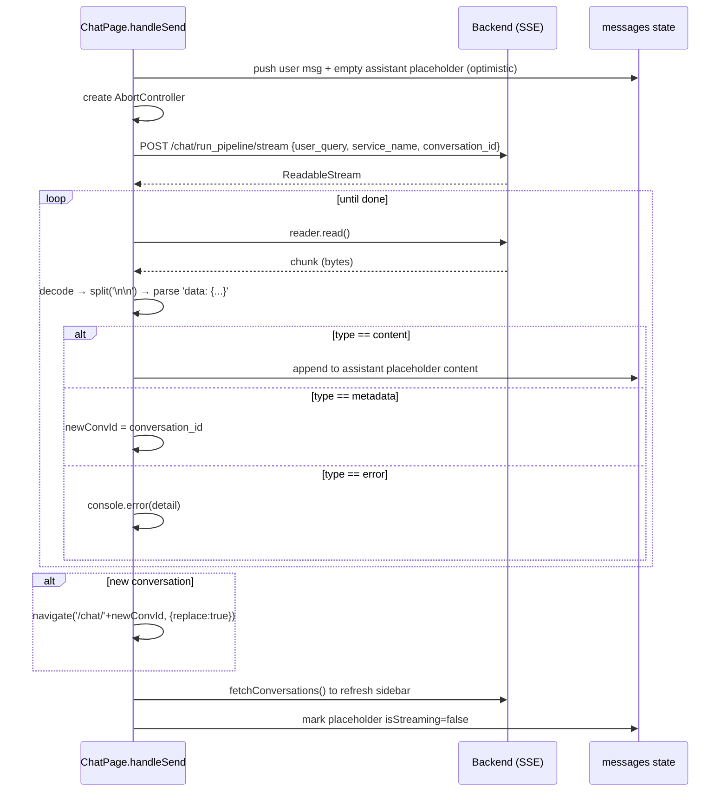

# 10 — API Integration & Contracts

[← Back to Index](./index.md)

This chapter documents every backend call the UI makes, the request/response shapes **as the UI
consumes them**, and the two transport mechanisms (Axios REST and `fetch`-based SSE streaming).

> The authoritative API spec lives in the backend repo. The shapes below are reverse-engineered from
> how the front-end builds requests and reads responses — they are accurate to the client's
> expectations.

## Two transports

| Transport | Used for | Why |
|-----------|----------|-----|
| **Axios** (`src/api/client.js`) | All request/response JSON (auth, list/load/rename/delete chats) | Interceptors auto-attach token + handle 401 |
| **Native `fetch` + `ReadableStream`** (`src/pages/ChatPage.jsx`) | The streaming chat endpoint only | Browser Axios can't expose an incremental byte stream for SSE |

## The Axios client

```javascript
const client = axios.create({
  baseURL: config.API_BASE_URL,
  headers: { 'Content-Type': 'application/json' },
});
```

- **Request interceptor:** attaches `Authorization: Bearer <token>` from `localStorage`.
- **Response interceptor:** on `401`, clears the token and invokes the registered logout handler.

See [Chapter 08](./08-authentication.md) for interceptor detail.

---

## Auth endpoints

All under `config.endpoints.auth`. Base URL is prepended by Axios.

### `POST /auth/login-json`
- **Caller:** `AuthContext.login` (`src/context/AuthContext.jsx:55`)
- **Request:** `{ "email": string, "password": string }`
- **Response:** `{ "access_token": string }` (a JWT)
- **UI effect:** stores token, decodes claims into `user`.

### `POST /auth/signup`
- **Caller:** `AuthContext.signup` (`src/context/AuthContext.jsx:73`)
- **Request:** `{ "name": string, "email": string, "password": string, "role": ["ROLE_USER"] }`
- **Response:** (not read by the UI — success status only)

### `POST /auth/forget-password`
- **Caller:** `AuthPage` (`src/pages/AuthPage.jsx:78`)
- **Request:** `{ "email": string }`
- **Effect:** backend emails an OTP.

### `POST /auth/verify-otp-reset-password`
- **Caller:** `AuthPage` (`src/pages/AuthPage.jsx:84`)
- **Request:** `{ "email": string, "otp": string, "new_password": string }`

### `PUT /auth/reset-password` (change password)
- **Caller:** `ChangePasswordModal` (`src/components/ChangePasswordModal.jsx:34`)
- **Request:** `{ "old_password": string, "new_password": string }`
- **Auth:** requires bearer token (authenticated user).

### `DELETE /auth/delete-user`
- **Caller:** `AuthContext.deleteAccount` (`src/context/AuthContext.jsx:78`)
- **Request:** none (identified by token).
- **UI effect:** on success, logs out.

---

## Chat endpoints (non-streaming)

All under `config.endpoints.chat`.

### `GET /chat/conversations` — list conversations
- **Caller:** `ChatPage.fetchConversations` (`src/pages/ChatPage.jsx:35`)
- **Response (consumed shape):** an array of conversation summaries:
  ```json
  [ { "id": "string", "title": "string", "...": "..." } ]
  ```
  The UI reads `chat.id` and `chat.title` (`src/components/Sidebar.jsx:196-231`).

### `GET /chat/conversations/{id}` — load a conversation
- **Caller:** `ChatPage.loadChat` (`src/pages/ChatPage.jsx:50`), and also for copy/download.
- **Response (consumed shape):**
  ```json
  {
    "messages": [
      { "id": "string", "user": "string", "assistant": "string|null", "created_at": "string" }
    ]
  }
  ```
  Each backend "turn" contains both the user prompt and the assistant reply. The UI **flattens** each
  turn into two display messages (`src/pages/ChatPage.jsx:52-69`):
  ```javascript
  { id: turn.id + '-user', role: 'user',      content: turn.user,      created_at }
  { id: turn.id + '-ai',   role: 'assistant', content: turn.assistant, created_at }  // only if assistant present
  ```

### `PUT /chat/conversations/{id}/rename` — rename
- **Caller:** `ChatPage.handleRenameChat` (`src/pages/ChatPage.jsx:267`)
- **Request:** `{ "title": string }`
- **Response (consumed):** `{ "title": string }` — the UI updates the list with the returned title.

### `DELETE /chat/conversations/{id}` — delete one
- **Caller:** `ChatPage.handleDeleteChat` (`src/pages/ChatPage.jsx:101`)
- Uses the `conversation(id)` helper, not `delete_conversation(id)`.

### `DELETE /chat/conversations` — delete all
- **Caller:** `ChatPage.handleDeleteAllConversations` (`src/pages/ChatPage.jsx:113`)
- **Response (consumed):** `{ "message": string }` — surfaced in the success toast in `ProfileModal`.

---

## Streaming chat — `POST /chat/run_pipeline/stream`

This is the core of the app. It is **not** called through Axios; it uses `fetch` so the response body
can be read incrementally.

### Request

```javascript
fetch(`${config.API_BASE_URL}${config.endpoints.chat.stream}`, {
  method: 'POST',
  headers: {
    'Content-Type': 'application/json',
    'Authorization': `Bearer ${localStorage.getItem('token')}`,
  },
  body: JSON.stringify({
    user_query: text,                 // the user's message
    service_name: serviceName,        // one of the 5 services
    conversation_id: currentChatId,   // null for a brand-new conversation
  }),
  signal: abortControllerRef.current.signal,  // enables Stop
});
```

`serviceName` is resolved from the active toggle (`src/pages/ChatPage.jsx:143-147`):
`web_search` | `thinking` | `image_search` | `news_search`, else the default `chat`.

### Response — Server-Sent Events

The body is a stream of SSE frames separated by `\n\n`, each line prefixed with `data: ` and
containing a JSON object. The UI splits on `\n\n`, strips the `data: ` prefix, and `JSON.parse`s the
remainder (`src/pages/ChatPage.jsx:175-211`).

Three event `type`s are handled:

| `type` | Payload | UI behavior |
|--------|---------|-------------|
| `content` | `{ "type": "content", "content": "partial text" }` | Appended to the running assistant message; UI re-renders incrementally |
| `metadata` | `{ "type": "metadata", "conversation_id": "string" }` | If this was a new chat, captures the new id (used to update the URL when the stream ends) |
| `error` | `{ "type": "error", "detail": "string" }` | Logged to console (currently no visible UI surface) |

Example wire frames:

```text
data: {"type": "content", "content": "Hello"}

data: {"type": "content", "content": ", world"}

data: {"type": "metadata", "conversation_id": "abc123"}
```

### Streaming algorithm



### Stopping a stream

`handleStop` calls `abortControllerRef.current.abort()`, which rejects the `fetch` with an
`AbortError`. The catch block recognizes this and silently stops (no error message)
(`src/pages/ChatPage.jsx:224-229`, `245-251`).

### Regeneration

`handleRegenerate(messageId)` finds the assistant message, grabs the **preceding user message**, and
re-invokes `handleSend` with the current service toggles (`src/pages/ChatPage.jsx:253-264`). Note this
appends a new exchange rather than replacing the old one.

## Endpoint quick reference

| Method | Path | Purpose | Caller |
|--------|------|---------|--------|
| POST | `/auth/login-json` | Login | `AuthContext.login` |
| POST | `/auth/signup` | Register | `AuthContext.signup` |
| POST | `/auth/forget-password` | Request OTP | `AuthPage` |
| POST | `/auth/verify-otp-reset-password` | Reset via OTP | `AuthPage` |
| PUT | `/auth/reset-password` | Change password | `ChangePasswordModal` |
| DELETE | `/auth/delete-user` | Delete account | `AuthContext.deleteAccount` |
| GET | `/chat/conversations` | List chats | `ChatPage` |
| GET | `/chat/conversations/{id}` | Load chat | `ChatPage` |
| PUT | `/chat/conversations/{id}/rename` | Rename chat | `ChatPage` |
| DELETE | `/chat/conversations/{id}` | Delete chat | `ChatPage` |
| DELETE | `/chat/conversations` | Delete all | `ChatPage` |
| POST | `/chat/run_pipeline/stream` | Stream a response (SSE) | `ChatPage` (fetch) |

## Related chapters

- [Chapter 08 — Authentication](./08-authentication.md)
- [Chapter 14 — Data Flow & Sequence Diagrams](./14-data-flow.md)
- [Chapter 16 — Error Handling & Logging](./16-error-handling.md)
