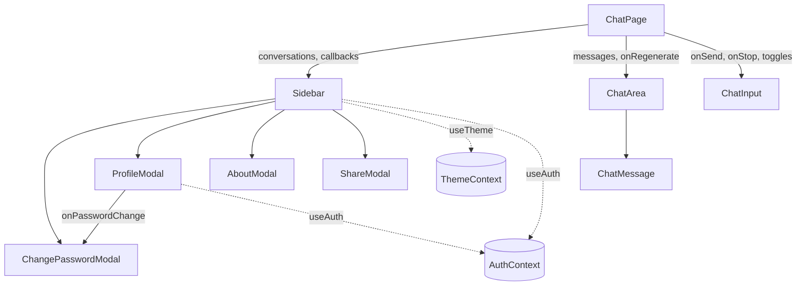

# 11 — Core Components

[← Back to Index](./index.md)

A reference for every component: its responsibility, props, key internal state, and how it
collaborates with others. Components are presentational/interactive; the chat "brain" is in
[`ChatPage`](#chatpage).

---

## Pages

### `AuthPage`
`src/pages/AuthPage.jsx` · 338 lines

One component renders **all four auth screens**, selected by the current route (see
[Chapter 07](./07-routing.md)).

- **Inputs:** route (`useLocation`), `login`/`signup` from `useAuth`.
- **Local state:** `email`, `password`, `confirmPassword`, `name`, `otp`, `newPassword`,
  `confirmNewPassword`, `showPassword`, plus `isLoading`/`error`/`success`.
- **Layout:** two columns — a branding hero (background `auth_banner.png` + overlay) on `lg+`, and the
  form column. Fields conditionally render per mode.
- **Validation:** password length ≥ 6, password/confirm match (signup & reset).
- **Errors:** surfaced from `err.response?.data?.detail` or a generic fallback.
- See [Chapter 08](./08-authentication.md) for the submit branching.

### `ChatPage`
`src/pages/ChatPage.jsx` · 387 lines

The **state owner and orchestrator** of the chat experience. Responsibilities:

- Fetch and hold the conversation list and the active thread.
- Send messages and consume the SSE stream (optimistic UI).
- Stop generation, regenerate, rename, delete (one/all), copy, and download chats.
- Manage service toggles and sidebar visibility.

**State & callbacks** are detailed in [Chapter 09](./09-state-management.md) and
[Chapter 10](./10-api-integration.md). It renders `Sidebar`, `ChatArea`, and `ChatInput`, wiring each
with props and callbacks. It shows a centered hero ("How can I help you today?") when the thread is
empty (`isChatEmpty`).

---

## Chat components

### `ChatArea`
`src/components/ChatArea.jsx` · 36 lines

- **Props:** `messages`, `isLoading`, `isStreaming`, `onRegenerate`.
- **Job:** render the scrollable list of `ChatMessage`s and **auto-scroll to the bottom** whenever
  messages change or streaming toggles (a `useEffect` sets `scrollTop = scrollHeight`).
- Returns `null` when there are no messages (the hero is shown by `ChatPage` instead).
- Shows a centered spinner when `isLoading && !isStreaming` (i.e. waiting for the first token).

### `ChatMessage`
`src/components/ChatMessage.jsx` · 195 lines

Renders a single message; the most styling-dense component.

- **Props:** `message` (`{ id, role, content, isStreaming }`), `onRegenerate`.
- **User vs assistant:** user messages render as a right-aligned bubble; assistant messages render
  full-width.
- **Markdown:** uses `react-markdown` with `remark-gfm` (tables, GFM) and `rehype-raw` (raw HTML).
- **Custom renderers** (passed as `components`):
  - `pre` → **`CodeBlock`**: a card with the detected language label and a **copy button** (copies the
    code's `innerText`, shows a check for 2s).
  - `code` → inline code styled as a pill; block code passes through inside `CodeBlock`.
  - `table`/`th`/`td` → styled, horizontally scrollable tables.
  - `a` → opens in a new tab with `rel="noopener noreferrer"` and an external-link icon.
- **Theme-aware prose:** a long list of `prose-*` classes plus per-theme overrides (e.g.
  `blue:prose-p:text-[...]`) ensures readable text in every theme (see
  [Chapter 13](./13-theming-styling.md)).
- **Streaming cursor:** when `message.isStreaming`, a pulsing block cursor is appended.
- **Action row** (assistant only, on hover): **Copy** and **Regenerate** buttons.

#### `CodeBlock` (internal)
A helper inside `ChatMessage` that wraps `<pre>`, extracts `language-xxx` from the child `code`'s
className for the label, and clones children to mark them as block-level (`isBlock`) so the inline-code
renderer doesn't pill-style them.

### `ChatInput`
`src/components/ChatInput.jsx` · 229 lines

The composer.

- **Props:** `onSend`, `isLoading`, `onStop`, `isHero`, and the four service toggle pairs
  (`isWebSearch`/`setIsWebSearch`, …).
- **Auto-growing textarea:** a `useEffect` resizes height to fit content up to 200px.
- **Service menu:** a `+` button opens a popover to pick a service; selecting one sets that toggle and
  clears the others (services are **mutually exclusive**).
- **Active-service badges:** a dismissible colored chip per active service (Web/Thinking/Image/News).
- **Submit:** Enter sends (Shift+Enter newlines). While loading with an `onStop` available, the button
  becomes **Stop**.
- **`isHero`:** when the thread is empty, the input is scaled up and centered.
- Footer disclaimer: "AI can make mistakes…" when not in hero mode.

---

## Sidebar & navigation

### `Sidebar`
`src/components/Sidebar.jsx` · 634 lines — the largest component

- **Props:** `conversations`, `currentChatId`, and callbacks: `onSelectChat`, `onNewChat`,
  `onDeleteChat`, `onDeleteAllConversations`, `onRenameChat`, `onCopyChat`, `onDownloadChat`, plus
  `isOpen`/`setIsOpen`.
- **Responsibilities:**
  - Render the conversation list with active highlighting and **inline rename** (click → edit, Enter
    to save, Escape to cancel, blur to submit).
  - Per-chat **action menu** (Share / Rename / Delete), rendered via `createPortal` at a computed
    position so it escapes overflow clipping.
  - **Collapsible/responsive** behavior: full width (`w-72`) when open, icon rail (`w-20`) when
    collapsed on desktop; off-canvas with a backdrop on mobile.
  - **User/profile menu** (also a portal): Profile, Change Password, **Themes submenu**, About, Logout.
  - The **theme picker** lists 20+ themes, each setting the theme via `useTheme().setTheme` and
    showing a check on the active one.
  - **Hosts all modals**: `ChangePasswordModal`, `ProfileModal`, `AboutModal`, `ShareModal`.
- **Why portals?** Menus must render above everything and outside the sidebar's `overflow-hidden`
  container; `createPortal(node, document.body)` achieves this.
- **Click-outside handling:** a document click listener closes menus.

> There is a small unused `UserIcon()` SVG function at the bottom of the file
> (`src/components/Sidebar.jsx:630`) — dead code, safe to remove.

---

## Modals

All modals follow the same pattern: a fixed full-screen backdrop (`bg-background/80 backdrop-blur`),
a centered card, and an early `if (!isOpen) return null;`. `ShareModal` additionally renders via a
portal.

### `ProfileModal`
`src/components/ProfileModal.jsx` · 252 lines

- **Props:** `isOpen`, `onClose`, `onPasswordChange`, `onDeleteAllChats`.
- Shows the avatar (first initial), name, email. Actions: Change Password (delegates up), Log Out,
  **Delete All Chat History**, **Delete Account**.
- **Two-step destructive confirmation:** both destructive actions use a step counter
  (`deleteStep` / `chatDeleteStep`, 0→1→2) requiring two explicit confirmations before executing.
  Shows a success state on completion. See [Chapter 12](./12-features.md#account--data-management).

### `ChangePasswordModal`
`src/components/ChangePasswordModal.jsx` · 161 lines

- **Props:** `isOpen`, `onClose`.
- Old/new/confirm fields; validates length ≥ 6 and match; calls `PUT /auth/reset-password`; success
  message then auto-close.

### `ShareModal`
`src/components/ShareModal.jsx` · 122 lines

- **Props:** `isOpen`, `onClose`, `onCopy`, `onDownload`, `chatTitle`.
- Two actions: **Copy entire chat** (to clipboard) and **Download as .txt**. Shows per-action loading
  spinners. Rendered via `createPortal`.

### `AboutModal`
`src/components/AboutModal.jsx` · 100 lines

- **Props:** `isOpen`, `onClose`.
- Static info: app name + version (`v1.0.0`), developer (Akash Gaur), tech stack (LangChain,
  LangGraph, FastAPI, React, Tailwind, Lucide), an "Operational" status dot, key-features grid, and
  social links (GitHub link is live; Globe/Mail buttons are placeholders).

---

## Guards & providers (cross-reference)

- **`ProtectedRoute`** — see [Chapter 07](./07-routing.md#route-guard).
- **`AuthProvider` / `ThemeProvider`** — see [Chapter 09](./09-state-management.md).

## Component interaction map

## Related chapters

- [Chapter 12 — Feature Implementation](./12-features.md)
- [Chapter 13 — Theming & Styling](./13-theming-styling.md)
