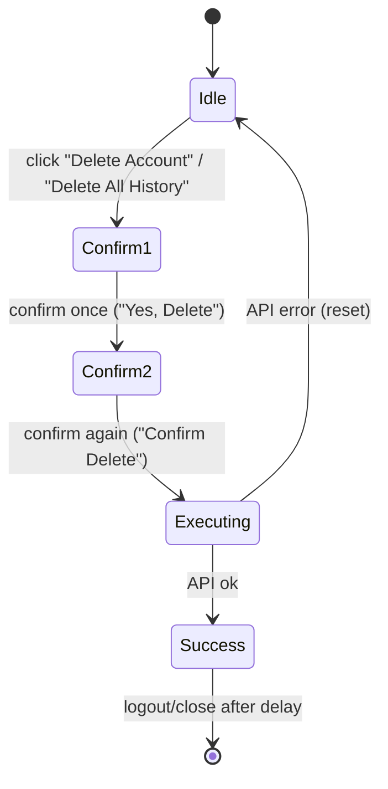

# 12 — Feature Implementation

[← Back to Index](./index.md)

Feature-by-feature walkthroughs that tie components, state, and API calls together. Each section names
the files and lines so you can trace the behavior.

---

## Real-time streaming chat

**Files:** `src/pages/ChatPage.jsx` (`handleSend`), `ChatInput`, `ChatArea`, `ChatMessage`.

The flow when a user sends a message:

1. **Optimistic insert** — push the user message and an empty assistant placeholder with
   `isStreaming: true` (`ChatPage.jsx:130-138`). The UI updates instantly.
2. **AbortController** — created and stored in a ref so the request can be stopped (`:140`).
3. **Resolve service** — the active toggle maps to a `service_name` (`:143-147`).
4. **`fetch` the stream** — `POST /chat/run_pipeline/stream` with the token attached manually (`:156`).
5. **Read incrementally** — a `ReadableStream` reader + `TextDecoder`; chunks split on `\n\n`, each
   `data:` line JSON-parsed (`:170-211`).
6. **Append tokens** — `content` events concatenate into the placeholder's `content` (`:187-197`).
7. **Capture new id** — `metadata` events carry `conversation_id` for brand-new chats (`:198-202`).
8. **Finish** — on stream end, navigate to `/chat/<newId>` (replace) for new chats, refresh the
   conversation list, and clear `isStreaming` on the placeholder (`:214-241`).

See the sequence diagram in [Chapter 10](./10-api-integration.md#streaming-algorithm).

### Stop generation
`ChatInput`'s send button becomes a **Stop** button while streaming. `handleStop` aborts the
controller; the resulting `AbortError` is caught and ignored (`ChatPage.jsx:245-251`).

### Regenerate
The hover action on assistant messages calls `onRegenerate(message.id)`. `ChatPage.handleRegenerate`
locates the preceding user message and re-sends it with the current service toggles
(`ChatPage.jsx:253-264`).

---

## AI services (chat / web / thinking / image / news)

**Files:** `src/config.js`, `ChatInput`, `ChatPage`.

- The five services come from `config.services.available`.
- In `ChatInput`, the `+` menu lets the user pick one; selecting sets that toggle and **clears the
  others** (mutually exclusive) and shows a colored, dismissible badge.
- On send, `ChatPage` maps the active toggle to the `service_name` field of the stream request. With no
  toggle, it falls back to `config.services.default` (`"chat"`).

| Service | `service_name` | Badge color | Icon |
|---------|----------------|-------------|------|
| Standard chat | `chat` | — | — |
| Web search | `web_search` | blue | `Globe` |
| Thinking | `thinking` | purple | `Brain` |
| Image search | `image_search` | emerald | `Image` |
| News search | `news_search` | orange | `Newspaper` |

> The toggles live in `ChatPage` state and are passed both to `ChatInput` (for the UI) and used in
> `handleSend`/`handleRegenerate`.

---

## Conversation history

**Files:** `Sidebar`, `ChatPage`.

- **List:** `fetchConversations()` populates the sidebar on mount and after each send/delete/rename.
- **Open:** clicking a chat calls `onSelectChat(id)` → `navigate('/chat/<id>')` → effect reloads it.
- **Active highlight:** the sidebar compares `currentChatId === chat.id`.
- **New chat:** `onNewChat` navigates to `/chat` (empty thread); on mobile it also closes the sidebar.
- **Mobile UX:** selecting a chat on a narrow viewport (`< 1024px`) auto-closes the sidebar.

### Rename
Inline edit in the sidebar (`editingId`/`editTitle`). Save on Enter or blur → `onRenameChat(id, title)`
→ `PUT /chat/conversations/{id}/rename`; the list updates with the returned title.

### Delete one
Action menu → Delete → `handleDeleteChat` confirms via `window.confirm`, calls
`DELETE /chat/conversations/{id}`, removes it from state, and starts a new chat if it was active.

### Delete all
From `ProfileModal` → `onDeleteAllConversations` → `DELETE /chat/conversations`; clears state and
navigates to `/chat`. Returns the backend's `{ message }` for the success toast.

---

## Sharing & export

**Files:** `ShareModal`, `ChatPage` (`handleCopyChat`, `handleDownloadChat`, `formatChatContent`).

When the user picks **Share** on a conversation, `ShareModal` offers:

- **Copy entire chat** → fetches the conversation, formats it as plain text, writes to clipboard via
  `navigator.clipboard.writeText`.
- **Download as .txt** → same formatting, then creates a `Blob`, an object URL, and a temporary `<a>`
  to trigger a download named `<title>.txt`.

Formatting (`formatChatContent`, `ChatPage.jsx:277-284`) renders each turn as:

```text
User: <prompt>
AI: <assistant reply>
```

turns separated by blank lines.

---

## Markdown & code rendering

**File:** `ChatMessage`.

- GFM via `remark-gfm` (tables, autolinks, strikethrough); raw HTML via `rehype-raw`.
- **Code blocks** get a header with the detected language and a copy button.
- **Tables** are wrapped for horizontal scroll and styled headers.
- **Links** open in new tabs safely with an external-link icon.
- A **pulsing cursor** marks the message currently being streamed.

See [Chapter 11 — ChatMessage](./11-components.md#chatmessage) for renderer details.

---

## Theming

**Files:** `ThemeContext`, `index.css`, `tailwind.config.js`, theme picker in `Sidebar`.

20+ runtime themes; selection persists to `localStorage` and toggles a class on `<html>`. Fully
documented in [Chapter 13 — Theming & Styling](./13-theming-styling.md).

---

## Account & data management

**Files:** `ProfileModal`, `ChangePasswordModal`, `AuthContext`.

- **Profile view:** avatar (initial), name, email from the decoded JWT.
- **Change password:** `ChangePasswordModal` → `PUT /auth/reset-password`.
- **Two-step destructive confirmations** in `ProfileModal`:



  - **Delete account** → `DELETE /auth/delete-user`, then logout.
  - **Delete all chats** → `DELETE /chat/conversations`.
  - Both require two explicit confirmations to avoid accidents. The final confirm button is styled red
    and pulses.

---

## Responsive & adaptive UI

- **Sidebar** collapses to an icon rail on desktop and goes off-canvas (with a tap-to-dismiss
  backdrop) on mobile.
- **Hero state:** the empty-thread layout centers the logo, greeting, and an enlarged input.
- **Auto-scroll:** new content keeps the view pinned to the latest message.
- **Auto-growing input** up to a max height with an internal scrollbar.

## Feature → file quick map

| Feature | Primary files |
|---------|---------------|
| Streaming chat | `ChatPage.jsx`, `ChatInput.jsx`, `ChatArea.jsx`, `ChatMessage.jsx` |
| Services | `config.js`, `ChatInput.jsx`, `ChatPage.jsx` |
| History CRUD | `Sidebar.jsx`, `ChatPage.jsx` |
| Sharing/export | `ShareModal.jsx`, `ChatPage.jsx` |
| Auth flows | `AuthPage.jsx`, `AuthContext.jsx` |
| Account management | `ProfileModal.jsx`, `ChangePasswordModal.jsx` |
| Theming | `ThemeContext.jsx`, `index.css`, `Sidebar.jsx` |

## Related chapters

- [Chapter 10 — API Integration](./10-api-integration.md)
- [Chapter 14 — Data Flow & Sequence Diagrams](./14-data-flow.md)
