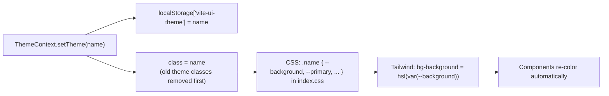

# 13 — Theming & Styling

[← Back to Index](./index.md)

The app ships a large catalog of runtime-selectable color themes. This chapter explains the
end-to-end theming mechanism and the styling conventions.

## How theming works (3 moving parts)



1. **State + persistence** — `ThemeContext` (`src/context/ThemeContext.jsx`) holds the theme name,
   writes it to `localStorage` under **`vite-ui-theme`**, and toggles a class on
   `document.documentElement` (the `<html>` element).
2. **CSS variables per theme** — `src/index.css` defines each theme as a class block that sets HSL
   color tokens (`--background`, `--foreground`, `--primary`, `--muted`, …).
3. **Tailwind binds to the variables** — `tailwind.config.js` maps semantic color utilities to
   `hsl(var(--token))`, so `bg-background`, `text-primary`, etc. resolve to the active theme's values.

The result: switching the class on `<html>` instantly re-themes the entire app with **no component
re-render logic** beyond the class swap.

## The theme switch effect

```javascript
useEffect(() => {
  const root = window.document.documentElement;
  root.classList.remove("light", "dark", "quite-light", "blue", /* ...all themes... */);
  if (theme === "system") {
    root.classList.add(prefersDark ? "dark" : "light");
    return;
  }
  root.classList.add(theme);
}, [theme]);
```

> **Maintenance gotcha:** the list of classes to `remove` is **hard-coded** in
> `ThemeContext.jsx:21`. When you add a new theme you must add it in **three places**:
> (1) the CSS block in `index.css`, (2) this `remove(...)` list, and (3) the custom variant in
> `tailwind.config.js` (and the picker in `Sidebar.jsx`). Missing (2) leaves a stale class on `<html>`
> when switching away.

## Available themes

Default light theme is `:root`; the rest are class blocks in `src/index.css`. Themes defined in CSS:

| Theme class | Family | In picker? |
|-------------|--------|-----------|
| `:root` (light) | Light | Yes ("Light") |
| `dark` | Dark | Yes |
| `blue` | Dark blue | Yes |
| `quite-light` | Warm light | Yes ("Quite Light") |
| `light-mint` | Light | Yes |
| `cool-gray` | Light/neutral | Yes |
| `midnight-green` | Dark | Yes |
| `deep-slate` | Dark | Yes |
| `carbon-black` | Dark | Yes |
| `deep-graphite` | Dark | Yes |
| `midnight-blue` | Dark | defined in CSS, **not** in picker |
| `earth-tone` | Warm | Yes |
| `warm-sun` | Warm | Yes |
| `peach-coral` | Warm | Yes |
| `lavender-indigo` | Light | Yes |
| `sage-green` | Light | Yes |
| `warm-stone` | Light | Yes |
| `terracotta-clay` | Warm | Yes |
| `steel-blue` | Light/neutral | Yes |
| `mocha-brown` | Warm | Yes |

> `clean-blue` has a registered Tailwind variant and a `remove()` entry but its picker button is
> commented out and it has no CSS block — effectively inactive.

## The design-token contract

Every theme defines the same set of HSL tokens (values vary per theme). Example (default light,
`index.css:6-36`):

```css
:root {
  --background: 0 0% 100%;
  --foreground: 222.2 84% 4.9%;
  --card: ...; --card-foreground: ...;
  --popover: ...; --popover-foreground: ...;
  --primary: 221.2 83.2% 53.3%;  --primary-foreground: ...;
  --secondary: ...; --muted: ...; --muted-foreground: ...;
  --accent: ...; --destructive: ...;
  --border: ...; --input: ...; --ring: ...;
  --radius: 0.5rem;
}
```

These map to Tailwind utilities in `tailwind.config.js`:

```javascript
colors: {
  background: "hsl(var(--background))",
  foreground: "hsl(var(--foreground))",
  primary:   { DEFAULT: "hsl(var(--primary))",   foreground: "hsl(var(--primary-foreground))" },
  muted:     { DEFAULT: "hsl(var(--muted))",     foreground: "hsl(var(--muted-foreground))" },
  // ... border, input, ring, secondary, accent, destructive, popover, card
}
```

> **Why HSL components without `hsl(...)`?** Storing `H S% L%` (not a full color) lets Tailwind compose
> alpha via `hsl(var(--token) / <alpha>)`, enabling classes like `bg-primary/90` or `bg-muted/30`.

## Tailwind config highlights (`tailwind.config.js`)

- **`darkMode: "class"`** — dark mode is class-driven (not the media query), consistent with the theme
  system.
- **`content`** — `index.html` + `src/**/*.{js,ts,jsx,tsx}`.
- **`borderRadius`** — derived from `--radius`.
- **Keyframes/animation** — `fade-in`, `slide-up`, accordion helpers.
- **Plugins:**
  - `@tailwindcss/typography` — the `prose` classes used by `ChatMessage`.
  - A **custom plugin** registering a Tailwind *variant* per theme:
    ```javascript
    addVariant('blue', '.blue &')
    addVariant('midnight-green', '.midnight-green &')
    // ...one per theme
    ```
    This lets components write theme-scoped utilities like `blue:prose-p:text-[hsl(210_40%_98%)]` to
    fix text contrast in specific themes (heavily used in `ChatMessage.jsx:100-116`).

## Per-theme chat bubble styling

`index.css` also defines `.<theme> .user-bubble` and `.<theme> .ai-bubble` rules (≈ lines 739-932) so
message bubbles get appropriate surface/contrast colors in each theme (e.g. `carbon-black` uses a
white user bubble and a near-black AI bubble). Base styles:

```css
@layer base {
  * { @apply border-border; }
  body { @apply bg-background text-foreground; }
}
```

## Custom scrollbars

Three utility classes in `@layer utilities` (`index.css:935-999`):

| Class | Width | Used by |
|-------|-------|---------|
| `scrollbar-thin` | 6px | sidebar conversation list |
| `scrollbar-fancy` | 8px (with hover) | the message area |
| `scrollbar-minimal` | 4px | the input textarea |

They support both `scrollbar-width` (Firefox) and `::-webkit-scrollbar` (Chromium/WebKit).

## The `cn()` helper

`src/lib/utils.js` exports the standard shadcn-style class combiner:

```javascript
export function cn(...inputs) {
  return twMerge(clsx(inputs));
}
```

`clsx` resolves conditional/array/object class inputs; `twMerge` dedupes conflicting Tailwind classes
(e.g. `p-2 p-4` → `p-4`). Used pervasively for conditional styling.

## Adding a new theme — checklist

1. Add `.my-theme { --background: ...; /* full token set */ }` to `src/index.css`.
2. (Optional) Add `.my-theme .user-bubble` / `.ai-bubble` overrides.
3. Add `"my-theme"` to the `root.classList.remove(...)` list in `ThemeContext.jsx`.
4. Add `addVariant('my-theme', '.my-theme &')` in `tailwind.config.js` (only if you need
   theme-scoped utilities).
5. Add a picker button in `Sidebar.jsx`'s theme submenu.
6. If text contrast needs tuning in `ChatMessage`, add `my-theme:prose-*` overrides.

## Related chapters

- [Chapter 09 — State Management](./09-state-management.md) (ThemeContext)
- [Chapter 11 — Core Components](./11-components.md) (Sidebar theme picker, ChatMessage prose)
