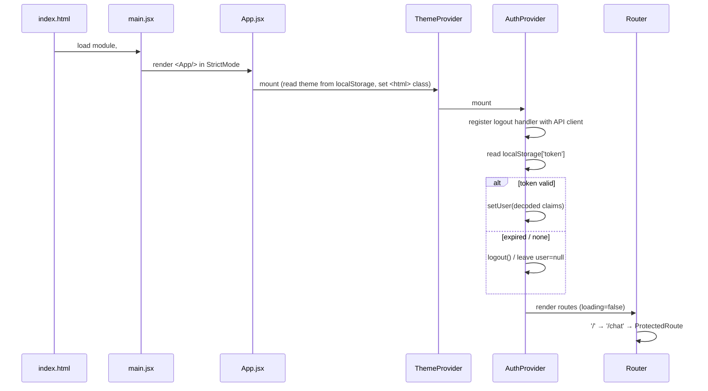
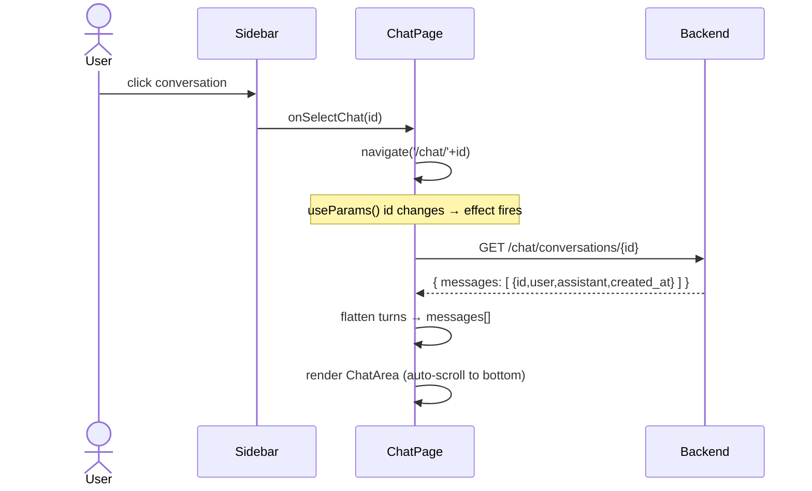
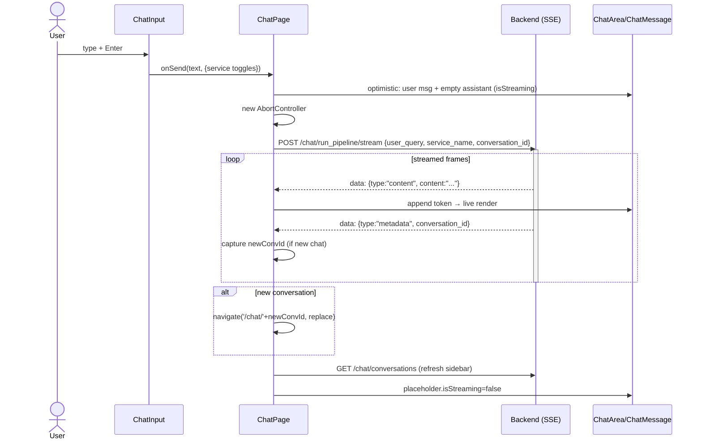
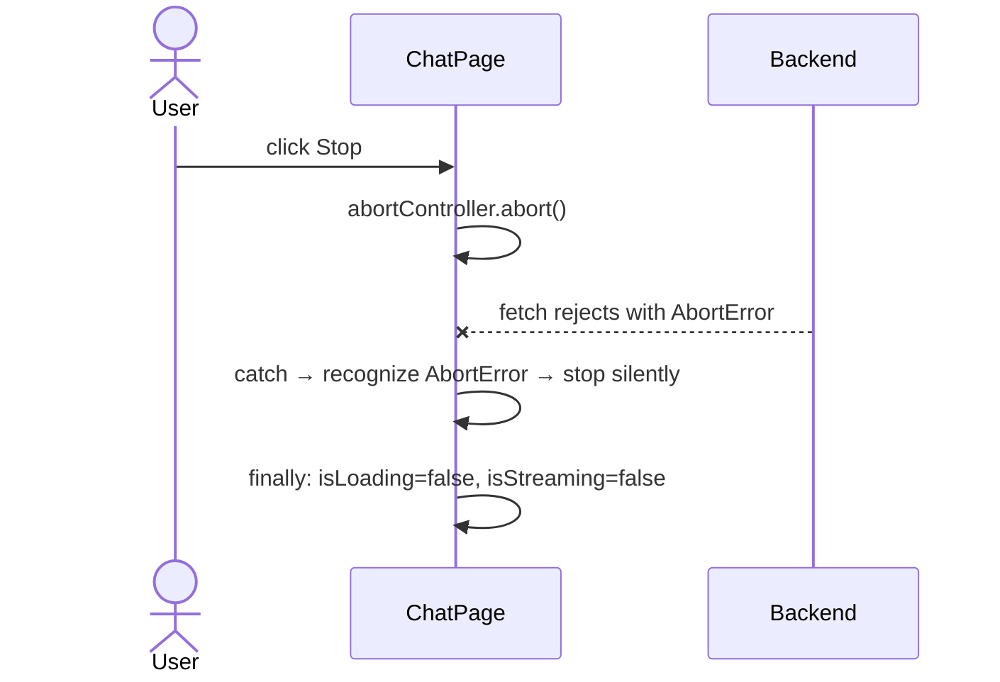
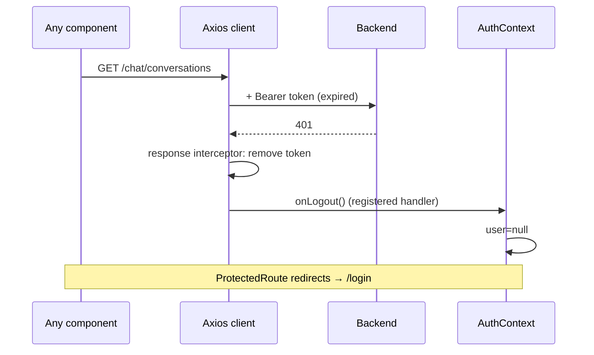
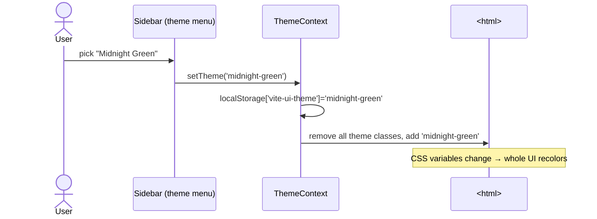
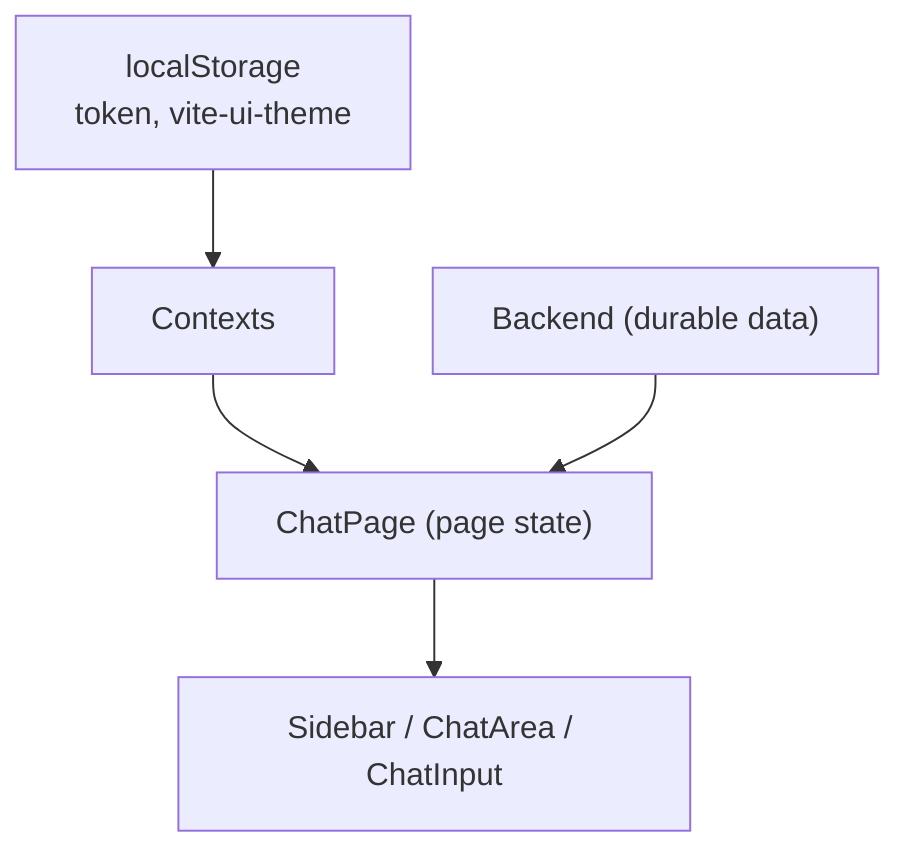

# 14 — Data Flow & Sequence Diagrams

[← Back to Index](./index.md)

This chapter visualizes the most important end-to-end flows. For wire-level detail see
[Chapter 10](./10-api-integration.md); for auth specifics see [Chapter 08](./08-authentication.md).

## App bootstrap & session restore



## Login → chat

```mermaid
sequenceDiagram
    actor U as User
    participant Auth as AuthPage
    participant Ctx as AuthContext
    participant Cl as Axios client
    participant API as Backend

    U->>Auth: enter email/password, submit
    Auth->>Ctx: login(email, password)
    Ctx->>Cl: POST /auth/login-json
    Cl->>API: + Content-Type json
    API-->>Cl: 200 { access_token }
    Cl-->>Ctx: response
    Ctx->>Ctx: localStorage['token']=access_token; setUser(decode)
    Ctx-->>Auth: ok
    Auth->>Auth: navigate('/')
    Note over U,API: ProtectedRoute now passes → ChatPage renders
```

## Opening an existing conversation



## Sending a message (streaming) — full picture



### With Stop pressed



## Token expiry / 401 (Axios calls)



> Reminder: this auto-logout applies to **Axios** calls. The streaming `fetch` does not route through
> the interceptor (see [Chapter 16](./16-error-handling.md)).

## Theme change



## State ownership summary



## Related chapters

- [Chapter 10 — API Integration](./10-api-integration.md)
- [Chapter 16 — Error Handling & Logging](./16-error-handling.md)
