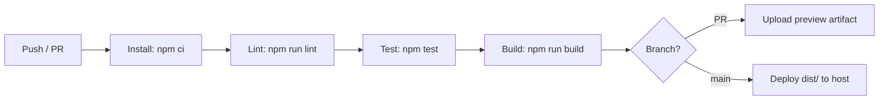

# 19 — Build, Deployment & CI/CD

[← Back to Index](./index.md)

## Build

The project is built with **Vite**. `npm run build` runs `vite build`, which:

1. Resolves the entry from `index.html` → `src/main.jsx`.
2. Bundles, tree-shakes, and minifies JS/CSS (esbuild + Rollup under the hood).
3. Compiles Tailwind (PostCSS) — only used utility classes plus the `@layer` theme blocks are emitted.
4. Hashes asset filenames for cache-busting.
5. Copies everything in `public/` to the output root.
6. Emits the result to **`dist/`** (git-ignored).

Output is a fully **static** site (HTML + JS + CSS + images). There is no server runtime.

```bash
npm run build      # → dist/
npm run preview    # serve dist/ locally to verify
```

## What ends up in `dist/`

- `index.html` (with hashed asset references)
- `assets/*.js`, `assets/*.css` (hashed)
- Copied static assets from `public/` (logos, banner, favicons)

## Deployment options

Because the build is static, any static host works. The app is an SPA using `BrowserRouter`, so the
host **must rewrite all unknown routes to `index.html`** (otherwise refreshing `/chat/123` 404s).

### Static hosts (recommended)

| Host | SPA rewrite config |
|------|--------------------|
| **Netlify** | `_redirects` file: `/* /index.html 200` |
| **Vercel** | `vercel.json` rewrites: `{ "rewrites": [{ "source": "/(.*)", "destination": "/index.html" }] }` |
| **GitHub Pages** | Use a `404.html` copy of `index.html` (hash-router is an alternative) |
| **AWS S3 + CloudFront** | Set error document to `index.html` (200) |

### Nginx example

```nginx
server {
    listen 80;
    root /var/www/aichatapp-ui/dist;
    index index.html;

    location / {
        try_files $uri $uri/ /index.html;   # SPA fallback
    }
}
```

### Docker example

```dockerfile
# Build stage
FROM node:18-alpine AS build
WORKDIR /app
COPY package*.json ./
RUN npm ci
COPY . .
RUN npm run build

# Serve stage
FROM nginx:alpine
COPY --from=build /app/dist /usr/share/nginx/html
COPY nginx.conf /etc/nginx/conf.d/default.conf   # with SPA fallback
EXPOSE 80
```

## Backend coupling at deploy time

The deployed bundle has the **`API_BASE_URL` baked in at build time** (it's a JS constant in
`config.js`). Consequences:

- You must build with the correct backend URL for each environment, **or** migrate to a Vite env var
  (`VITE_API_BASE_URL`) and set it per environment before `npm run build` (see
  [Chapter 06](./06-configuration.md)).
- Ensure the backend's **CORS** policy allows the SPA's deployed origin.
- Use **HTTPS** for the backend in production (see [Chapter 17](./17-security.md)).

## CI/CD

**No CI/CD is configured in this repo today** (no `.github/workflows`, no other pipeline files).

### Recommended pipeline



A minimal GitHub Actions starter:

```yaml
name: CI
on: [push, pull_request]
jobs:
  build:
    runs-on: ubuntu-latest
    steps:
      - uses: actions/checkout@v4
      - uses: actions/setup-node@v4
        with: { node-version: 18, cache: npm }
      - run: npm ci
      - run: npm run lint
      # - run: npm test          # once tests exist (Chapter 18)
      - run: npm run build
        env:
          VITE_API_BASE_URL: ${{ vars.API_BASE_URL }}   # if migrated to env var
      - uses: actions/upload-artifact@v4
        with: { name: dist, path: dist }
```

Add a deploy job (Netlify/Vercel/S3/etc.) gated on `main` and successful build.

## Versioning

- The npm `version` is `0.0.0` (placeholder). The user-facing version (`v1.0.0`) is hard-coded in
  `AboutModal`. Consider wiring a single source of version truth (e.g. inject `package.json` version
  into the build) if version display matters.

## Pre-deploy checklist

- [ ] `API_BASE_URL` (or `VITE_API_BASE_URL`) points to the correct **HTTPS** backend.
- [ ] `npm run lint` passes.
- [ ] `npm run build` succeeds; `npm run preview` looks correct.
- [ ] Host configured with SPA fallback to `index.html`.
- [ ] Backend CORS allows the deployed origin.

## Related chapters

- [Chapter 05 — Getting Started](./05-getting-started.md)
- [Chapter 06 — Configuration](./06-configuration.md)
- [Chapter 17 — Security](./17-security.md)
