# Architecture Diagrams

AIChatApp-UI is a React 18 single-page application built with Vite and Tailwind CSS that delivers a real-time AI chat experience. The frontend communicates with a FastAPI backend over REST (via Axios) for authentication and conversation management, and over Server-Sent Events (SSE) using the native Fetch API for token-by-token streaming responses. Two React Context providers — `AuthProvider` and `ThemeProvider` — supply global state, while all chat-specific state lives locally in `ChatPage`. The app supports 20+ visual themes, four AI service modes (web search, thinking, image search, news search), and a full conversation history with rename/delete/export capabilities.

---

## Contents

1. [System Architecture](#1-system-architecture)
2. [Component Tree](#2-component-tree)
3. [Authentication Flow](#3-authentication-flow)
4. [Chat SSE Streaming Flow](#4-chat-sse-streaming-flow)
5. [State Management](#5-state-management)
6. [Routing & Navigation](#6-routing--navigation)
7. [Data Model](#7-data-model)
8. [Theme System](#8-theme-system)

---

## 1. System Architecture

Shows the full deployment topology: browser-side context providers, React Router, UI component groups, the dual transport layer (Axios + Fetch/SSE), backend service split, and external AI/search services reached through the backend.

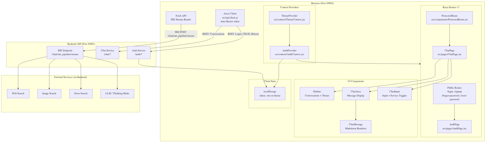

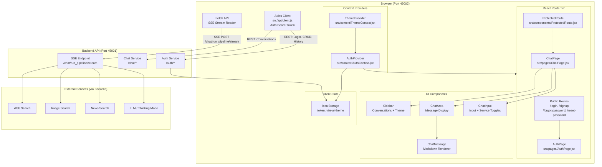
```mermaid
graph TB
    subgraph Browser["Browser (Port 45002)"]
        subgraph Providers["Context Providers"]
            TP["ThemeProvider<br/>src/context/ThemeContext.jsx"]
            AP["AuthProvider<br/>src/context/AuthContext.jsx"]
        end

        subgraph Router["React Router v7"]
            PUB["Public Routes<br/>/login, /signup<br/>/forgot-password, /reset-password"]
            PR["ProtectedRoute<br/>src/components/ProtectedRoute.jsx"]
            CHAT["ChatPage<br/>src/pages/ChatPage.jsx"]
            AUTH["AuthPage<br/>src/pages/AuthPage.jsx"]
        end

        subgraph Components["UI Components"]
            SB["Sidebar<br/>Conversations + Theme"]
            CA["ChatArea<br/>Message Display"]
            CI["ChatInput<br/>Input + Service Toggles"]
            CM["ChatMessage<br/>Markdown Renderer"]
        end

        subgraph State["Client State"]
            LS["localStorage<br/>token, vite-ui-theme"]
        end

        AX["Axios Client<br/>src/api/client.js<br/>Auto Bearer token"]
        FETCH["Fetch API<br/>SSE Stream Reader"]
    end

    subgraph Backend["Backend API (Port 45001)"]
        AUTHAPI["Auth Service<br/>/auth/*"]
        CHATAPI["Chat Service<br/>/chat/*"]
        STREAM["SSE Endpoint<br/>/chat/run_pipeline/stream"]
    end

    subgraph ExternalSvcs["External Services (via Backend)"]
        WS["Web Search"]
        IS["Image Search"]
        NS["News Search"]
        LLM["LLM / Thinking Mode"]
    end

    TP --> AP --> Router
    PR --> CHAT
    PUB --> AUTH
    CHAT --> SB
    CHAT --> CA
    CHAT --> CI
    CA --> CM

    AX -->|"REST: Login, CRUD, History"| AUTHAPI
    AX -->|"REST: Conversations"| CHATAPI
    FETCH -->|"SSE POST /chat/run_pipeline/stream"| STREAM

    AUTHAPI --> LS
    AP --> LS

    STREAM --> WS
    STREAM --> IS
    STREAM --> NS
    STREAM --> LLM
```

---

## 2. Component Tree

Full React component hierarchy from `main.jsx` down to leaf components. Shows the provider wrapping order, page-level split, and which modals are owned by which container.

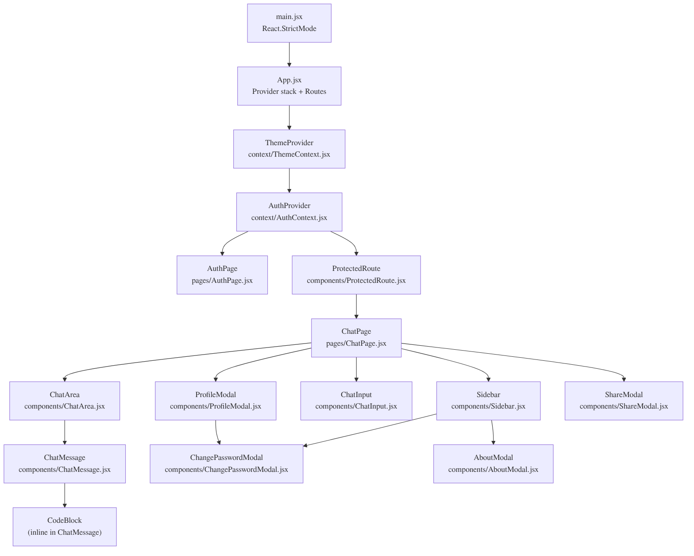

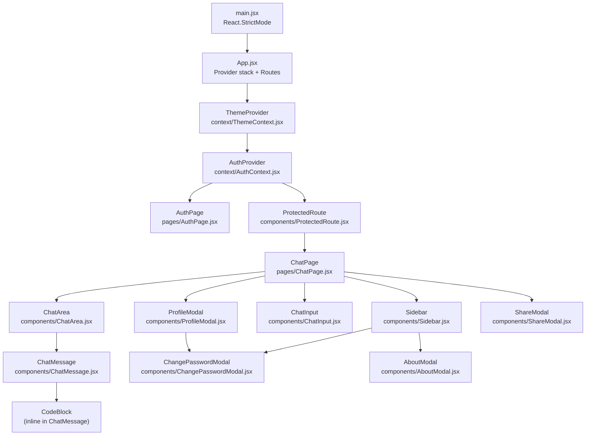
```mermaid
graph TD
    MAIN["main.jsx<br/>React.StrictMode"]
    APP["App.jsx<br/>Provider stack + Routes"]

    TP["ThemeProvider<br/>context/ThemeContext.jsx"]
    AP["AuthProvider<br/>context/AuthContext.jsx"]

    AUTHP["AuthPage<br/>pages/AuthPage.jsx"]
    CHATP["ChatPage<br/>pages/ChatPage.jsx"]
    PROTR["ProtectedRoute<br/>components/ProtectedRoute.jsx"]

    SB["Sidebar<br/>components/Sidebar.jsx"]
    CA["ChatArea<br/>components/ChatArea.jsx"]
    CI["ChatInput<br/>components/ChatInput.jsx"]

    CM["ChatMessage<br/>components/ChatMessage.jsx"]
    CB["CodeBlock<br/>(inline in ChatMessage)"]

    PM["ProfileModal<br/>components/ProfileModal.jsx"]
    CPM["ChangePasswordModal<br/>components/ChangePasswordModal.jsx"]
    SM["ShareModal<br/>components/ShareModal.jsx"]
    AM["AboutModal<br/>components/AboutModal.jsx"]

    MAIN --> APP
    APP --> TP
    TP --> AP
    AP --> AUTHP
    AP --> PROTR
    PROTR --> CHATP

    CHATP --> SB
    CHATP --> CA
    CHATP --> CI
    CHATP --> PM
    CHATP --> SM

    CA --> CM
    CM --> CB

    SB --> CPM
    SB --> AM

    PM --> CPM
```

---

## 3. Authentication Flow

Sequence diagram covering the four auth paths (login, signup, forgot/reset password), token storage in localStorage, protected-route checks on navigation, and the Axios 401 interceptor that auto-logs-out on token expiry.

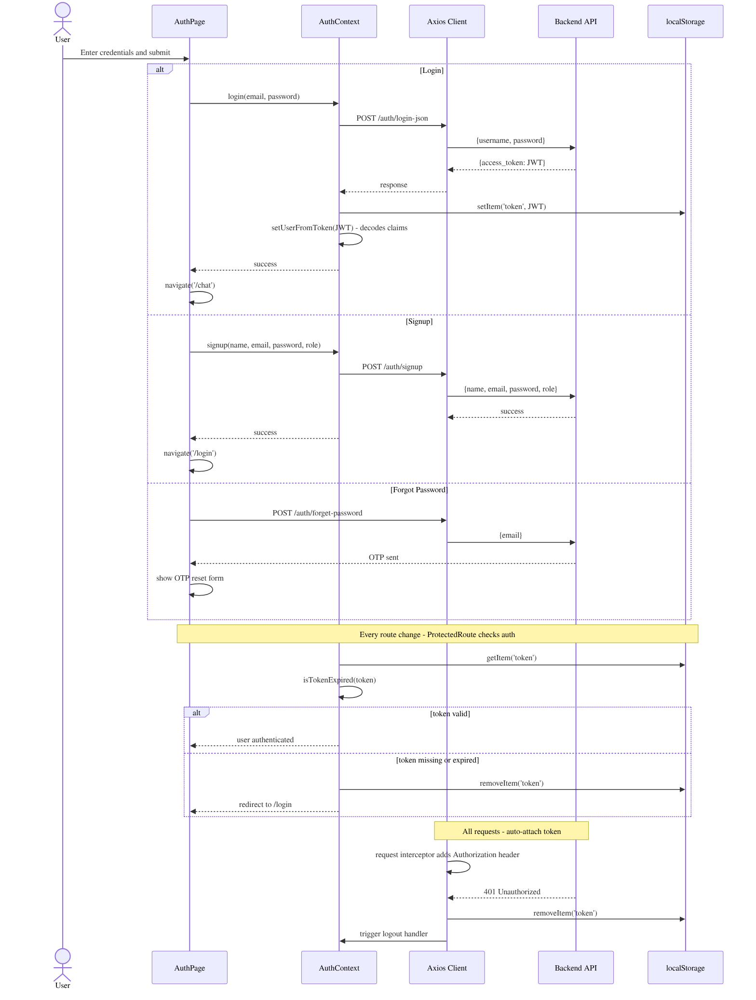

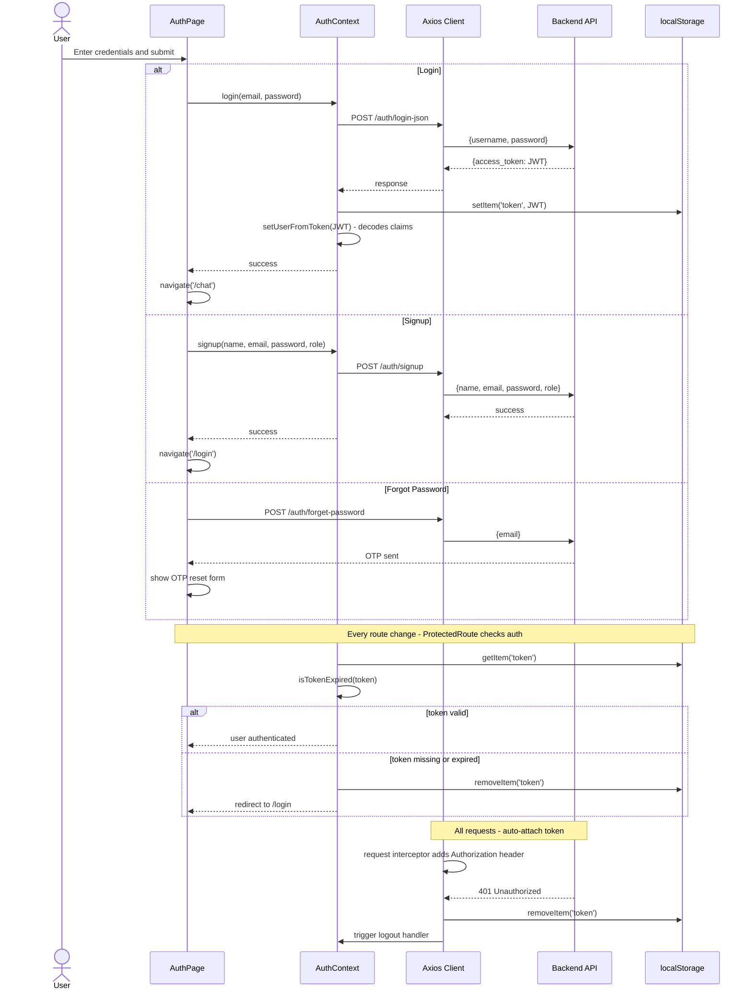
```mermaid
sequenceDiagram
    actor User
    participant AuthPage as AuthPage
    participant AuthCtx as AuthContext
    participant AxiosClient as Axios Client
    participant Backend as Backend API
    participant LocalStorage as localStorage

    User->>AuthPage: Enter credentials and submit

    alt Login
        AuthPage->>AuthCtx: login(email, password)
        AuthCtx->>AxiosClient: POST /auth/login-json
        AxiosClient->>Backend: {username, password}
        Backend-->>AxiosClient: {access_token: JWT}
        AxiosClient-->>AuthCtx: response
        AuthCtx->>LocalStorage: setItem('token', JWT)
        AuthCtx->>AuthCtx: setUserFromToken(JWT) - decodes claims
        AuthCtx-->>AuthPage: success
        AuthPage->>AuthPage: navigate('/chat')
    else Signup
        AuthPage->>AuthCtx: signup(name, email, password, role)
        AuthCtx->>AxiosClient: POST /auth/signup
        AxiosClient->>Backend: {name, email, password, role}
        Backend-->>AxiosClient: success
        AuthCtx-->>AuthPage: success
        AuthPage->>AuthPage: navigate('/login')
    else Forgot Password
        AuthPage->>AxiosClient: POST /auth/forget-password
        AxiosClient->>Backend: {email}
        Backend-->>AuthPage: OTP sent
        AuthPage->>AuthPage: show OTP reset form
    end

    Note over AuthPage,LocalStorage: Every route change - ProtectedRoute checks auth
    AuthCtx->>LocalStorage: getItem('token')
    AuthCtx->>AuthCtx: isTokenExpired(token)
    alt token valid
        AuthCtx-->>AuthPage: user authenticated
    else token missing or expired
        AuthCtx->>LocalStorage: removeItem('token')
        AuthCtx-->>AuthPage: redirect to /login
    end

    Note over AxiosClient,Backend: All requests - auto-attach token
    AxiosClient->>AxiosClient: request interceptor adds Authorization header
    Backend-->>AxiosClient: 401 Unauthorized
    AxiosClient->>LocalStorage: removeItem('token')
    AxiosClient->>AuthCtx: trigger logout handler
```

---

## 4. Chat SSE Streaming Flow

End-to-end sequence for a user sending a message: optimistic UI update, SSE stream setup with AbortController, chunk-by-chunk content events, the metadata event that establishes the conversation ID, and the stop/regenerate user actions.

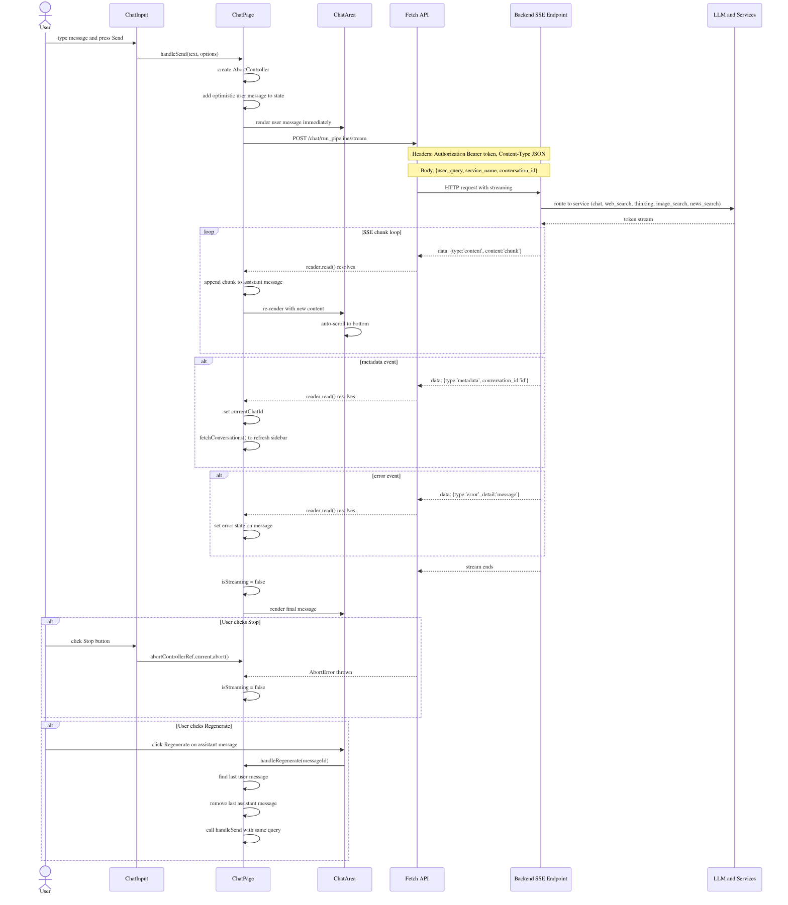

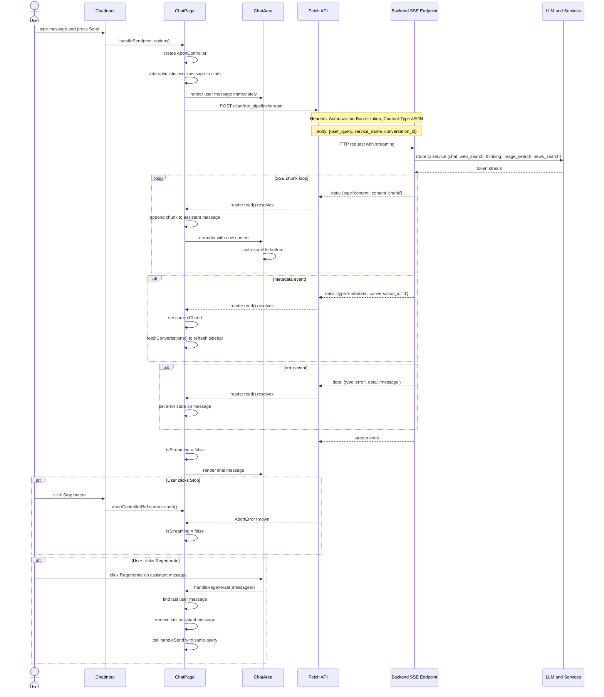
```mermaid
sequenceDiagram
    actor User
    participant ChatInput as ChatInput
    participant ChatPage as ChatPage
    participant ChatArea as ChatArea
    participant FetchAPI as Fetch API
    participant Backend as Backend SSE Endpoint
    participant LLM as LLM and Services

    User->>ChatInput: type message and press Send
    ChatInput->>ChatPage: handleSend(text, options)

    ChatPage->>ChatPage: create AbortController
    ChatPage->>ChatPage: add optimistic user message to state
    ChatPage->>ChatArea: render user message immediately

    ChatPage->>FetchAPI: POST /chat/run_pipeline/stream
    Note over FetchAPI,Backend: Headers: Authorization Bearer token, Content-Type JSON
    Note over FetchAPI,Backend: Body: {user_query, service_name, conversation_id}

    FetchAPI->>Backend: HTTP request with streaming
    Backend->>LLM: route to service (chat, web_search, thinking, image_search, news_search)
    LLM-->>Backend: token stream

    loop SSE chunk loop
        Backend-->>FetchAPI: data: {type:'content', content:'chunk'}
        FetchAPI-->>ChatPage: reader.read() resolves
        ChatPage->>ChatPage: append chunk to assistant message
        ChatPage->>ChatArea: re-render with new content
        ChatArea->>ChatArea: auto-scroll to bottom
    end

    alt metadata event
        Backend-->>FetchAPI: data: {type:'metadata', conversation_id:'id'}
        FetchAPI-->>ChatPage: reader.read() resolves
        ChatPage->>ChatPage: set currentChatId
        ChatPage->>ChatPage: fetchConversations() to refresh sidebar
    end

    alt error event
        Backend-->>FetchAPI: data: {type:'error', detail:'message'}
        FetchAPI-->>ChatPage: reader.read() resolves
        ChatPage->>ChatPage: set error state on message
    end

    Backend-->>FetchAPI: stream ends
    ChatPage->>ChatPage: isStreaming = false
    ChatPage->>ChatArea: render final message

    alt User clicks Stop
        User->>ChatInput: click Stop button
        ChatInput->>ChatPage: abortControllerRef.current.abort()
        FetchAPI-->>ChatPage: AbortError thrown
        ChatPage->>ChatPage: isStreaming = false
    end

    alt User clicks Regenerate
        User->>ChatArea: click Regenerate on assistant message
        ChatArea->>ChatPage: handleRegenerate(messageId)
        ChatPage->>ChatPage: find last user message
        ChatPage->>ChatPage: remove last assistant message
        ChatPage->>ChatPage: call handleSend with same query
    end
```

---

## 5. State Management

Shows both global Context stores (`AuthContext`, `ThemeContext`), their localStorage bindings, the full set of local state variables in `ChatPage`, and `Sidebar`'s local state. Illustrates which state lives where and why.

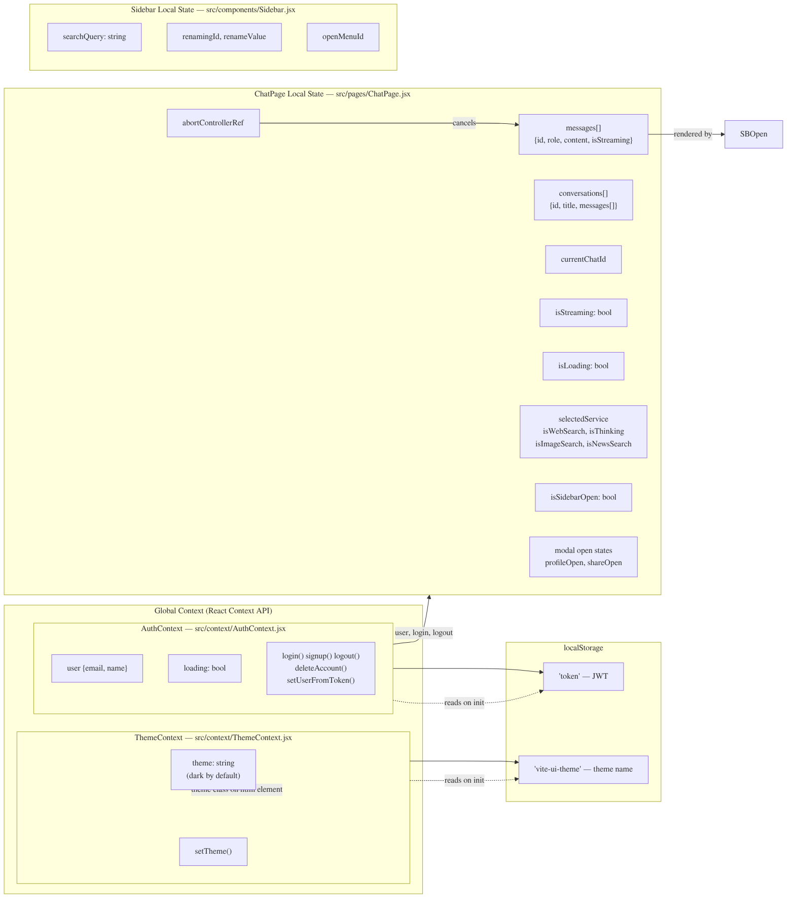

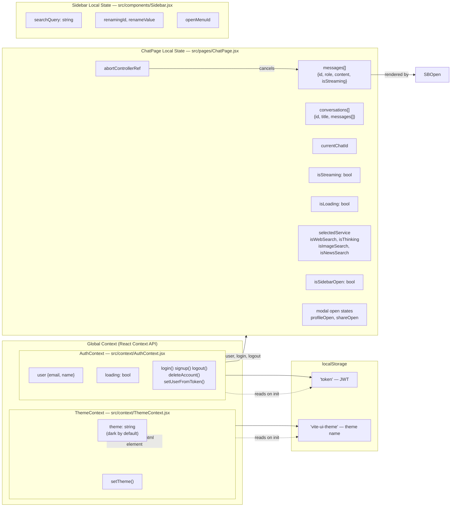
```mermaid
graph LR
    subgraph Global["Global Context (React Context API)"]
        subgraph AuthCtx["AuthContext — src/context/AuthContext.jsx"]
            AU["user {email, name}"]
            AL["loading: bool"]
            AFNS["login() signup() logout()<br/>deleteAccount()<br/>setUserFromToken()"]
        end

        subgraph ThemeCtx["ThemeContext — src/context/ThemeContext.jsx"]
            TH["theme: string<br/>(dark by default)"]
            TFN["setTheme()"]
        end
    end

    subgraph LocalStorage["localStorage"]
        TOK["'token' — JWT"]
        THM["'vite-ui-theme' — theme name"]
    end

    subgraph PageState["ChatPage Local State — src/pages/ChatPage.jsx"]
        MSG["messages[]<br/>{id, role, content, isStreaming}"]
        CONVS["conversations[]<br/>{id, title, messages[]}"]
        CID["currentChatId"]
        ISTR["isStreaming: bool"]
        ILOAD["isLoading: bool"]
        SVSVC["selectedService<br/>isWebSearch, isThinking<br/>isImageSearch, isNewsSearch"]
        ABORT["abortControllerRef"]
        SBOPEN["isSidebarOpen: bool"]
        MODAL["modal open states<br/>profileOpen, shareOpen"]
    end

    subgraph SidebarState["Sidebar Local State — src/components/Sidebar.jsx"]
        SEARCH["searchQuery: string"]
        RENAME["renamingId, renameValue"]
        DELMENU["openMenuId"]
    end

    AuthCtx --> TOK
    ThemeCtx --> THM
    AuthCtx -.->|"reads on init"| TOK
    ThemeCtx -.->|"reads on init"| THM

    AuthCtx -->|"user, login, logout"| PageState
    ThemeCtx -->|"theme class on html element"| TH

    ABORT -->|"cancels"| MSG
    MSG -->|"rendered by"| SBOpen
```

---

## 6. Routing & Navigation

Flowchart of all navigation paths: catch-all redirect, protected route guard, all auth form transitions, and how the first SSE response triggers a URL update to `/chat/:id`.

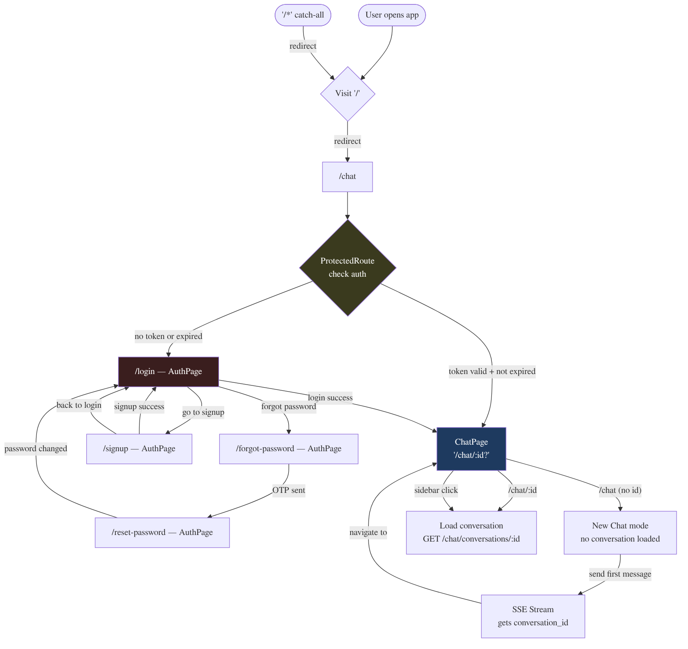

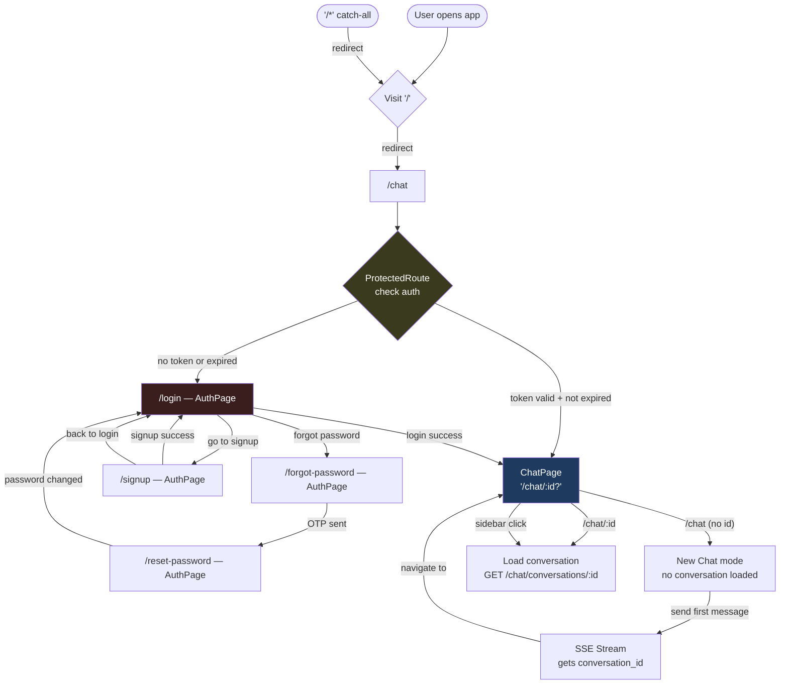
```mermaid
flowchart TD
    START([User opens app]) --> ROOT{Visit '/'}
    ROOT -->|redirect| CHAT_ROUTE["/chat"]

    CHAT_ROUTE --> PROT{ProtectedRoute<br/>check auth}

    PROT -->|"token valid + not expired"| CHATPAGE["ChatPage<br/>'/chat/:id?'"]
    PROT -->|"no token or expired"| LOGIN["/login — AuthPage"]

    LOGIN -->|"login success"| CHATPAGE
    LOGIN -->|"go to signup"| SIGNUP["/signup — AuthPage"]
    LOGIN -->|"forgot password"| FORGOT["/forgot-password — AuthPage"]

    SIGNUP -->|"signup success"| LOGIN
    SIGNUP -->|"back to login"| LOGIN

    FORGOT -->|"OTP sent"| RESET["/reset-password — AuthPage"]
    RESET -->|"password changed"| LOGIN

    CHATPAGE -->|"/chat (no id)"| NEWCHAT["New Chat mode<br/>no conversation loaded"]
    CHATPAGE -->|"/chat/:id"| LOADCHAT["Load conversation<br/>GET /chat/conversations/:id"]

    NEWCHAT -->|"send first message"| MSGFLOW["SSE Stream<br/>gets conversation_id"]
    MSGFLOW -->|"navigate to"| CHATPAGE

    CHATPAGE -->|"sidebar click"| LOADCHAT

    CATCH(["'/*' catch-all"]) -->|redirect| ROOT

    style CHATPAGE fill:#1e3a5f,color:#fff
    style LOGIN fill:#3a1e1e,color:#fff
    style PROT fill:#3a3a1e,color:#fff
```

---

## 7. Data Model

ER diagram of the core data structures: how backend `Conversation` and `Turn` objects map to the frontend `Message` display model, SSE event payloads, JWT claims, and the Theme registry.

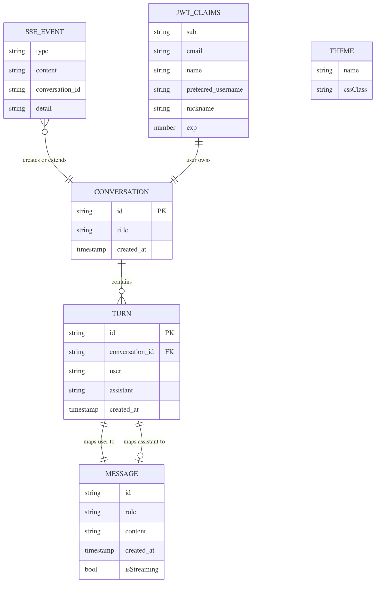

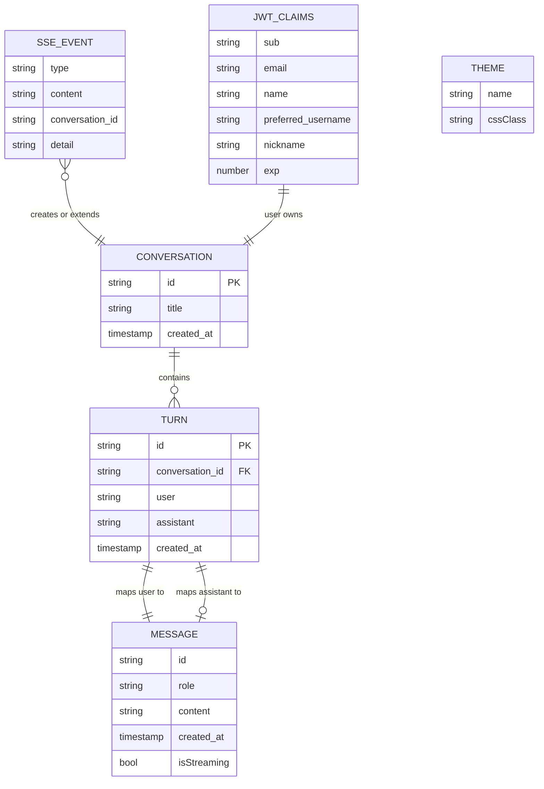
```mermaid
erDiagram
    CONVERSATION {
        string id PK
        string title
        timestamp created_at
    }

    TURN {
        string id PK
        string conversation_id FK
        string user
        string assistant
        timestamp created_at
    }

    MESSAGE {
        string id
        string role
        string content
        timestamp created_at
        bool isStreaming
    }

    SSE_EVENT {
        string type
        string content
        string conversation_id
        string detail
    }

    JWT_CLAIMS {
        string sub
        string email
        string name
        string preferred_username
        string nickname
        number exp
    }

    THEME {
        string name
        string cssClass
    }

    CONVERSATION ||--o{ TURN : "contains"
    TURN ||--|| MESSAGE : "maps user to"
    TURN ||--o| MESSAGE : "maps assistant to"
    SSE_EVENT }o--|| CONVERSATION : "creates or extends"
    JWT_CLAIMS ||--|| CONVERSATION : "user owns"
```

---

## 8. Theme System

Architecture of the 20-theme system: `ThemeContext` → localStorage → `document.documentElement` class → CSS custom properties → Tailwind variants. Shows the full chain from user click to rendered pixel.

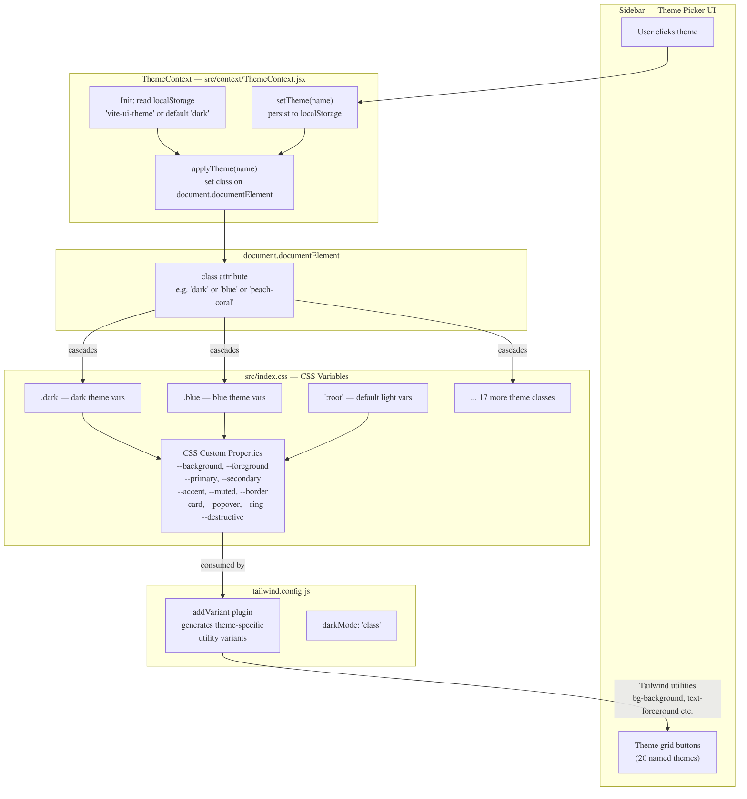

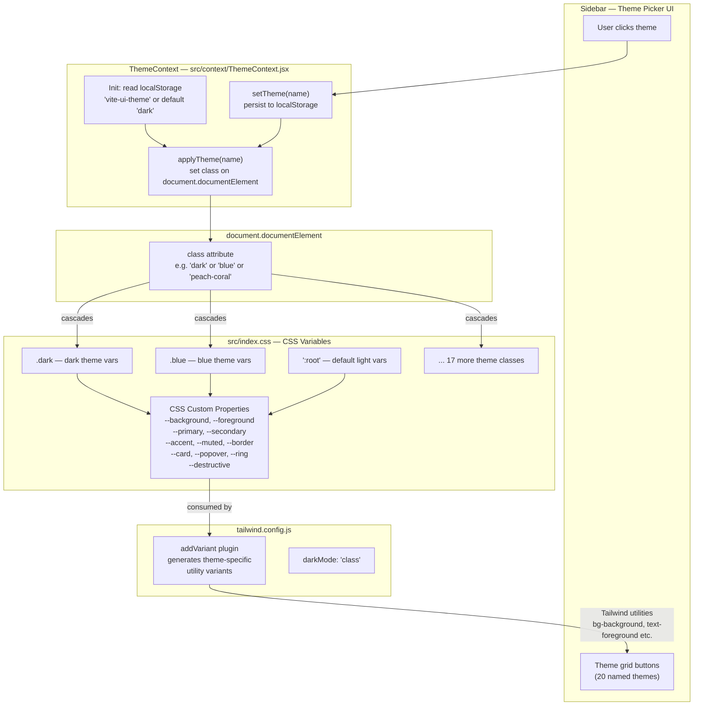
```mermaid
graph TD
    subgraph ThemeCtx["ThemeContext — src/context/ThemeContext.jsx"]
        INIT["Init: read localStorage<br/>'vite-ui-theme' or default 'dark'"]
        SET["setTheme(name)<br/>persist to localStorage"]
        APPLY["applyTheme(name)<br/>set class on document.documentElement"]
    end

    subgraph Sidebar["Sidebar — Theme Picker UI"]
        GRID["Theme grid buttons<br/>(20 named themes)"]
        CLICK["User clicks theme"]
    end

    subgraph HTML["document.documentElement"]
        CLASS["class attribute<br/>e.g. 'dark' or 'blue' or 'peach-coral'"]
    end

    subgraph CSS["src/index.css — CSS Variables"]
        ROOT["':root' — default light vars"]
        DARK[".dark — dark theme vars"]
        BLUE[".blue — blue theme vars"]
        DOTS["... 17 more theme classes"]

        VARS["CSS Custom Properties<br/>--background, --foreground<br/>--primary, --secondary<br/>--accent, --muted, --border<br/>--card, --popover, --ring<br/>--destructive"]
    end

    subgraph Tailwind["tailwind.config.js"]
        PLUGIN["addVariant plugin<br/>generates theme-specific<br/>utility variants"]
        DM["darkMode: 'class'"]
    end

    INIT --> APPLY
    CLICK --> SET
    SET --> APPLY
    APPLY --> CLASS
    CLASS -->|"cascades"| DARK
    CLASS -->|"cascades"| BLUE
    CLASS -->|"cascades"| DOTS
    DARK --> VARS
    BLUE --> VARS
    ROOT --> VARS
    VARS -->|"consumed by"| PLUGIN
    PLUGIN -->|"Tailwind utilities<br/>bg-background, text-foreground etc."| GRID
```
